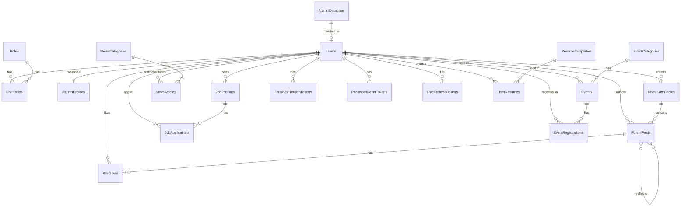
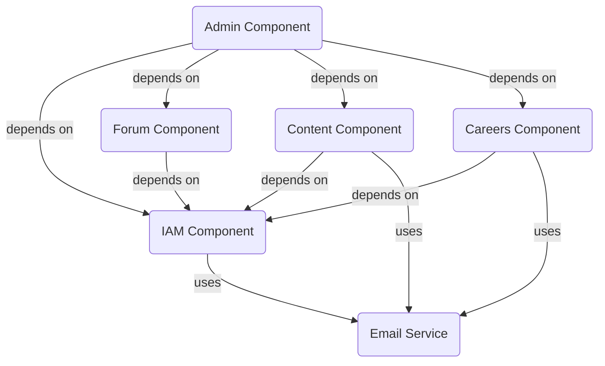
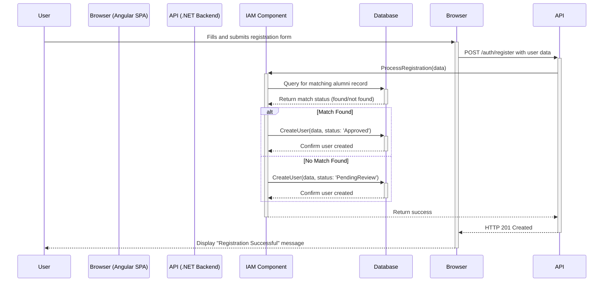
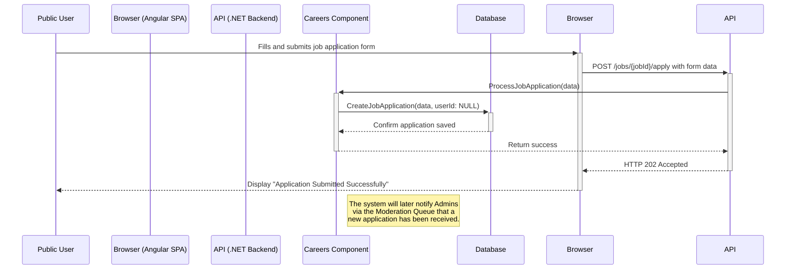
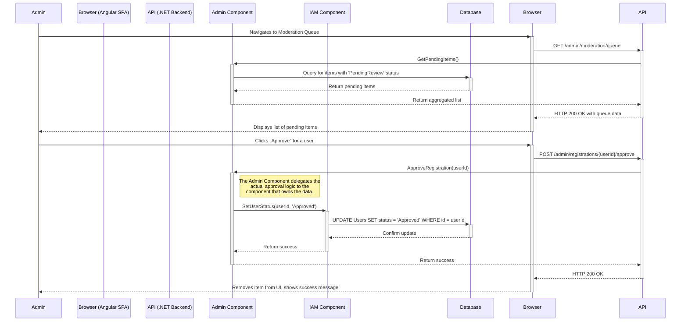

Understood. I'll provide the complete architecture document one section at a time, with full detail. Here's the first section. 🏛️

---
## **1. Introduction**

This document outlines the complete fullstack architecture for the IHCAE Alumni Network Application, including backend systems, frontend implementation, and their integration. It serves as the single source of truth for AI-driven development, ensuring consistency across the entire technology stack.

### **Starter Template or Existing Project**
N/A - This is a greenfield project. The architecture will be designed from scratch to meet the specific requirements outlined in the PRD.

### **Change Log**
| Date | Version | Description | Author |
| :--- | :--- | :--- | :--- |
| 2025-10-10 | 1.0 | Initial architecture draft based on PRD v1.0. | Winston, Architect |

---

Here's the complete second section. 🏗️

-----

## **2. High-Level Architecture**

### **Technical Summary**

The IHCAE Alumni Network Application will be architected as a **monolithic web application**. It features an **Angular single-page application (SPA)** that communicates via **RESTful APIs** with a **.NET backend**. This layered, monolithic approach will be deployed on a **traditional server infrastructure (VPS)**, which is well-suited for its straightforward development and deployment model.

### **Platform and Infrastructure Choice** ☁️

The application will use a traditional **Virtual Private Server (VPS)** hosting model. This approach provides granular control over the server environment but requires manual configuration and maintenance for the web server, database, networking, and security.

  * **Platform**: Virtual Private Server (VPS) Hosting.
  * **Key Services (Software Stack)**:
      * **Web Server**: A Linux VPS running the .NET application via Kestrel, placed behind a reverse proxy like Nginx for security and performance.
      * **Database Server**: MySQL installed and managed on a separate, dedicated VPS instance for security and resource isolation.
      * **File Storage**: A block storage volume attached to the web server VPS will be used for user uploads.
  * **Deployment Host and Regions**: The primary server(s) will be located in a datacenter in India (e.g., Bangalore or Mumbai region) to ensure low latency for the user base.

### **High-Level Architecture Diagram**

```mermaid
graph TD
    subgraph Users
        A[Public User]
        B[Alumnus/Trainee]
        C[Administrator]
    end

    subgraph "VPS Hosting Environment"
        D[Browser <br/>(Angular SPA)]
        E[Web Server VPS <br/>(Nginx + .NET Monolith)]
        F[Database VPS <br/>(MySQL)]
        G[Block Storage Volume]
    end

    A -- accesses public pages --> D
    B -- logs in/interacts --> D
    C -- manages system --> D
    D -- HTTPS/REST API --> E
    E -- Business Logic --> E
    E -- Data Access (EF Core) --> F
    E -- User File Uploads --> G
```

### **Architectural Patterns**

  * **Layered Architecture (Backend)**: Separates concerns into Presentation (API Controllers), Application (Business Logic), and Infrastructure (Data Access, External Services).
  * **Modular Architecture (Frontend)**: The Angular application will be organized into feature modules with lazy loading to optimize performance.
  * **Repository Pattern (Backend)**: To abstract the data access logic from the business logic, enabling easier testing and maintenance.
  * **RESTful API**: To provide a standardized, stateless communication layer between the frontend and backend.


---
## **3. Tech Stack**

This table is the single source of truth for all technologies, frameworks, and libraries to be used in the project. 💻

| Category | Technology | Version | Purpose | Rationale |
| :--- | :--- | :--- | :--- | :--- |
| Frontend Language | TypeScript | 5.4.x | Primary language for Angular development | Provides strong typing, improving code quality and maintainability. It's the standard for modern Angular development. |
| Frontend Framework| Angular | 17.x | Core framework for building the client-side SPA | A direct requirement from the PRD to build a robust and modular user interface. |
| UI Component Library| Tailwind CSS | 3.x | Utility-first CSS framework for styling | A direct requirement from the PRD for creating a custom, modern design without a restrictive component library. |
| State Management | Angular Services | 17.x | Managing and sharing application state | The PRD allows for a service-based approach, which is simpler and sufficient for this application's initial scope. |
| Backend Language | C# | 12 | Primary language for .NET development | C# is the native language for the .NET framework. |
| Backend Framework| .NET | 8.0 | Core framework for building the backend API and business logic | A direct requirement from the PRD for a robust, performant, and scalable backend. |
| API Style | REST | - | Standard for client-server communication | A direct requirement from the PRD to ensure predictable and standardized API design. |
| Database | MySQL | 8.0+ | Primary data store for all application data | A direct requirement from the PRD. |
| Cache | In-Memory Caching | .NET 8 | Performance optimization for frequently accessed data | Starts with the built-in, simplest caching solution. Avoids external dependencies until a distributed cache is proven necessary. |
| File Storage | Block Storage | - | Storing user-uploaded files (e.g., profile pictures) | A straightforward solution for a VPS environment, as decided in the high-level architecture. |
| Authentication | JWT | - | Securing API endpoints and managing user sessions | A standard, stateless method for modern web applications, as implied by Story 1.8 in the PRD. |
| Logging | Serilog | Latest | Structured logging for the .NET backend | A powerful and flexible logging library for .NET that allows for easy integration with various sinks (file, console, etc.). |
| Analytics | Google Analytics | GA4 | Tracking user behavior and site traffic | Industry standard for web analytics to gather insights on user engagement. |

---
Here's the complete fourth section, detailing the entire data model structure for the application. 🗃️

-----

## **4. Data Models**

This section consolidates all the data models for the IHCAE Alumni Network Application. 📊

### **Entity Relationship Diagram (ERD)**

This diagram provides a complete visual overview of how all the tables connect.



### **Detailed Schemas**

#### **User & Profile Management**

  * **Users**
      * **Purpose**: The central table for authentication and core identity for all users.
      * **Attributes**:
          * `id`: `UUID` (Primary Key)
          * `email`: `string` (Unique)
          * `passwordHash`: `string`
          * `firstName`: `string`
          * `lastName`: `string`
          * `status`: `enum` ('Pending', 'Approved', 'Rejected')
  * **Roles**
      * **Purpose**: A lookup table for user roles.
      * **Attributes**:
          * `id`: `integer` (Primary Key)
          * `name`: `string` (Unique - 'Alumnus', 'Trainee', 'Admin')
  * **UserRoles**
      * **Purpose**: A join table linking users to their roles.
      * **Attributes**:
          * `userId`: `UUID` (Composite PK, Foreign Key to Users)
          * `roleId`: `integer` (Composite PK, Foreign Key to Roles)
  * **AlumniProfiles**
      * **Purpose**: Stores detailed profile information specific to alumni.
      * **Attributes**:
          * `userId`: `UUID` (Primary Key, Foreign Key to Users)
          * `profileImageUrl`: `string` (nullable)
          * `graduationYear`: `number`
          * `course`: `string`
          * `bio`: `string` (nullable)
          * `jobTitle`: `string` (nullable)
          * `location`: `string` (nullable)

#### **Community Engagement**

  * **DiscussionTopics**
      * **Purpose**: Represents a conversation thread in the forum.
      * **Attributes**:
          * `id`: `UUID` (Primary Key)
          * `title`: `string`
          * `createdById`: `UUID` (Foreign Key to Users)
          * `isLocked`: `boolean`
          * `isPinned`: `boolean`
  * **ForumPosts**
      * **Purpose**: Stores individual comments and replies within a topic.
      * **Attributes**:
          * `id`: `UUID` (Primary Key)
          * `content`: `text`
          * `topicId`: `UUID` (Foreign Key to DiscussionTopics)
          * `authorId`: `UUID` (Foreign Key to Users)
          * `parentPostId`: `UUID` (nullable, Foreign Key to self)
  * **PostLikes**
      * **Purpose**: Tracks likes from users on specific forum posts.
      * **Attributes**:
          * `postId`: `UUID` (Composite PK, Foreign Key to ForumPosts)
          * `userId`: `UUID` (Composite PK, Foreign Key to Users)

#### **Content, Careers, & User Activity**

  * **NewsCategories** & **EventCategories**
      * **Purpose**: Lookup tables for categorizing content.
      * **Attributes**:
          * `id`: `integer` (Primary Key)
          * `name`: `string` (Unique)
  * **NewsArticles**
      * **Purpose**: A unified table for articles and alumni-submitted success stories.
      * **Attributes**:
          * `id`: `UUID` (PK), `title` (string), `slug` (string, Unique), `content` (text), `imageUrl` (string, nullable), `status` (enum), `authorId` (UUID, FK), `submittedById` (UUID, nullable, FK), `categoryId` (integer, nullable, FK).
  * **Events**
      * **Purpose**: Stores information for all campus and alumni events.
      * **Attributes**:
          * `id`: `UUID` (PK), `title` (string), `slug` (string, Unique), `description` (text), `location` (string), `startDate` (DateTime), `endDate` (DateTime), `status` (enum), `createdById` (UUID, FK), `categoryId` (integer, nullable, FK).
  * **JobPostings**
      * **Purpose**: Contains all career opportunities for the job board.
      * **Attributes**:
          * `id`: `UUID` (PK), `title` (string), `company` (string), `location` (string), `description` (text), `applicationLink` (string), `status` (enum), `postedById` (UUID, FK), `approvedById` (UUID, nullable, FK).
  * **JobApplications**
      * **Purpose**: Stores job applications from public and registered users.
      * **Attributes**:
          * `id`: `UUID` (PK), `jobPostingId` (UUID, FK), `userId` (UUID, nullable, FK), `applicantName` (string), `applicantEmail` (string), `applicantPhone` (string, nullable), `resumeUrl` (string), `coverLetter` (text, nullable), `status` (enum).
  * **EventRegistrations**
      * **Purpose**: Stores event registrations from public and registered users.
      * **Attributes**:
          * `eventId`: `UUID` (PK, FK), `registrantEmail` (string, PK), `userId` (UUID, nullable, FK), `registrantName` (string), `registrantPhone` (string, nullable).

-----
Here's the complete fifth section, detailing the entire API Specification for the application. 📡

---
## **5. API Specification**
Certainly. You're likely referring to the **OpenAPI Specification format**, which is the industry standard for defining REST APIs. I'll provide the specification in that `YAML` format.

Here's the complete detail for the **Authentication** subsection. 📄🔐

-----

## **5. API Specification**

### **Authentication (OpenAPI Format)**

```yaml
# This is a partial OpenAPI specification, focusing only on the Authentication endpoints.
# Full specification would include all paths and components.

openapi: 3.0.1
info:
  title: "IHCAE Alumni Network API"
  description: "The official API for the IHCAE Alumni Network application."
  version: "1.0.0"

servers:
  - url: "http://localhost:5000/api/v1"
    description: "Local Development Server"
  - url: "https://api.ihcaenetwork.com/api/v1"
    description: "Production Server"

tags:
  - name: Authentication
    description: "Endpoints for user registration and login."

paths:
  /auth/register:
    post:
      tags:
        - Authentication
      summary: "Register a new user"
      description: "Allows a new user to submit their registration details. The system checks against a pre-imported alumni list for auto-approval."
      requestBody:
        required: true
        content:
          application/json:
            schema:
              $ref: '#/components/schemas/RegisterRequest'
      responses:
        '201':
          description: "User successfully registered and is pending approval or is already approved."
        '400':
          description: "Invalid input, such as a duplicate email or missing required fields."

  /auth/login:
    post:
      tags:
        - Authentication
      summary: "Authenticate a user"
      description: "Authenticates a user with their email and password, returning a JWT if successful and the user is approved."
      requestBody:
        required: true
        content:
          application/json:
            schema:
              $ref: '#/components/schemas/LoginRequest'
      responses:
        '200':
          description: "Authentication successful."
          content:
            application/json:
              schema:
                $ref: '#/components/schemas/AuthResponse'
        '401':
          description: "Unauthorized - invalid credentials or user not yet approved."

components:
  schemas:
    RegisterRequest:
      type: object
      required:
        - firstName
        - lastName
        - email
        - password
      properties:
        firstName:
          type: string
          example: "John"
        lastName:
          type: string
          example: "Doe"
        email:
          type: string
          format: email
          example: "john.doe@example.com"
        password:
          type: string
          format: password
          example: "Str0ngP@ssw0rd!"
    LoginRequest:
      type: object
      required:
        - email
        - password
      properties:
        email:
          type: string
          format: email
          example: "john.doe@example.com"
        password:
          type: string
          format: password
          example: "Str0ngP@ssw0rd!"
    AuthResponse:
      type: object
      properties:
        token:
          type: string
          description: "The JWT bearer token for subsequent requests."
        user:
          $ref: '#/components/schemas/UserSummary'
    UserSummary:
      type: object
      properties:
        id:
          type: string
          format: uuid
        firstName:
          type: string
        lastName:
          type: string
        email:
          type: string
        roles:
          type: array
          items:
            type: string

  /auth/forgot-password:
    post:
      tags: [Authentication]
      summary: "Request password reset"
      description: "Sends password reset email if account exists. Always returns 202 to prevent email enumeration."
      requestBody:
        required: true
        content:
          application/json:
            schema:
              type: object
              required: [email]
              properties:
                email: { type: string, format: email }
      responses:
        '202': 
          description: "Reset email sent if account exists"
          content:
            application/json:
              schema:
                type: object
                properties:
                  message: { type: string, example: "If an account exists, a password reset link has been sent" }

  /auth/reset-password:
    post:
      tags: [Authentication]
      summary: "Reset password with token"
      description: "Resets user password using the token from reset email."
      requestBody:
        required: true
        content:
          application/json:
            schema:
              type: object
              required: [token, newPassword]
              properties:
                token: { type: string }
                newPassword: { type: string, minLength: 8 }
      responses:
        '200': 
          description: "Password reset successful"
          content:
            application/json:
              schema:
                type: object
                properties:
                  message: { type: string, example: "Password reset successfully" }
        '400': { description: "Invalid or expired token" }

  /auth/change-password:
    post:
      tags: [Authentication]
      summary: "Change password"
      description: "Allows logged-in users to change their password."
      security: [{ bearerAuth: [] }]
      requestBody:
        required: true
        content:
          application/json:
            schema:
              type: object
              required: [currentPassword, newPassword]
              properties:
                currentPassword: { type: string }
                newPassword: { type: string, minLength: 8 }
      responses:
        '200': 
          description: "Password changed successfully"
          content:
            application/json:
              schema:
                type: object
                properties:
                  message: { type: string, example: "Password changed successfully" }
        '400': { description: "Invalid current password" }
        '401': { description: "Unauthorized" }

  /auth/verify-email:
    post:
      tags: [Authentication]
      summary: "Verify email with token"
      description: "Verifies user email using the token from verification email."
      requestBody:
        required: true
        content:
          application/json:
            schema:
              type: object
              required: [token]
              properties:
                token: { type: string }
      responses:
        '200': 
          description: "Email verified successfully"
          content:
            application/json:
              schema:
                type: object
                properties:
                  message: { type: string, example: "Email verified successfully" }
        '400': { description: "Invalid or expired token" }

  /auth/resend-verification:
    post:
      tags: [Authentication]
      summary: "Resend verification email"
      description: "Sends a new verification email to the authenticated user."
      security: [{ bearerAuth: [] }]
      responses:
        '202': 
          description: "Verification email sent"
          content:
            application/json:
              schema:
                type: object
                properties:
                  message: { type: string, example: "Verification email sent" }
        '400': { description: "Email already verified" }
        '401': { description: "Unauthorized" }
```

-----

Here's the next subsection: **User Profile & Directory**. 👤

-----

## **5. API Specification (Continued)**

### **User Profile & Directory (OpenAPI Format)** 📂

```yaml
# This is a partial OpenAPI specification, focusing only on the User Profile & Directory endpoints.

tags:
  - name: User Profile & Directory
    description: "Endpoints for managing a user's own profile and viewing the alumni directory."

paths:
  /profile/me:
    get:
      tags:
        - User Profile & Directory
      summary: "Get current user's profile"
      description: "Fetches the complete profile information for the currently authenticated user."
      security:
        - bearerAuth: []
      responses:
        '200':
          description: "Successful response with the user's full profile."
          content:
            application/json:
              schema:
                $ref: '#/components/schemas/AlumniProfileResponse'
        '401':
          description: "Unauthorized."
    put:
      tags:
        - User Profile & Directory
      summary: "Update current user's profile"
      description: "Updates the profile information for the currently authenticated user."
      security:
        - bearerAuth: []
      requestBody:
        required: true
        content:
          application/json:
            schema:
              $ref: '#/components/schemas/UpdateProfileRequest'
      responses:
        '200':
          description: "Profile updated successfully."
          content:
            application/json:
              schema:
                $ref: '#/components/schemas/AlumniProfileResponse'
        '400':
          description: "Invalid input."
        '401':
          description: "Unauthorized."

  /alumni:
    get:
      tags:
        - User Profile & Directory
      summary: "Get a list of alumni"
      description: "Retrieves a paginated and searchable list of all approved alumni for the directory."
      security:
        - bearerAuth: []
      parameters:
        - name: search
          in: query
          schema: { type: string }
        - name: course
          in: query
          schema: { type: string }
        - name: gradYear
          in: query
          schema: { type: integer }
        - name: page
          in: query
          schema: { type: integer, default: 1 }
        - name: pageSize
          in: query
          schema: { type: integer, default: 20 }
      responses:
        '200':
          description: "A paginated list of alumni profiles."
          content:
            application/json:
              schema:
                type: array
                items:
                  $ref: '#/components/schemas/AlumniProfileResponse'
        '401':
          description: "Unauthorized."

  /alumni/{userId}:
    get:
      tags:
        - User Profile & Directory
      summary: "Get a specific alumnus profile"
      description: "Fetches the public profile for a single alumnus by their ID."
      security:
        - bearerAuth: []
      parameters:
        - name: userId
          in: path
          required: true
          schema: { type: string, format: uuid }
      responses:
        '200':
          description: "Successful response with the requested user's profile."
          content:
            application/json:
              schema:
                $ref: '#/components/schemas/AlumniProfileResponse'
        '401':
          description: "Unauthorized."
        '404':
          description: "User not found."

components:
  schemas:
    UpdateProfileRequest:
      type: object
      properties:
        profileImageUrl:
          type: string
          format: uri
        bio:
          type: string
        jobTitle:
          type: string
        location:
          type: string
    AlumniProfileResponse:
      type: object
      properties:
        id:
          type: string
          format: uuid
        firstName:
          type: string
        lastName:
          type: string
        email:
          type: string
          format: email
        profileImageUrl:
          type: string
          format: uri
        graduationYear:
          type: integer
        course:
          type: string
        bio:
          type: string
        jobTitle:
          type: string
        location:
          type: string
  securitySchemes:
    bearerAuth:
      type: http
      scheme: bearer
      bearerFormat: JWT
```

-----

Here's the next subsection: **Community Forums**. 💬

-----

## **5. API Specification (Continued)**

### **Community Forums (OpenAPI Format)** ✍️

```yaml
# This is a partial OpenAPI specification, focusing only on the Community Forums endpoints.

tags:
  - name: Community Forums
    description: "Endpoints for managing discussion topics, posts, and likes."

paths:
  /forums/topics:
    get:
      tags: [Community Forums]
      summary: "Get all discussion topics"
      description: "Retrieves a paginated list of all topics, sorted by recent activity."
      security: [{ bearerAuth: [] }]
      parameters:
        - { name: page, in: query, schema: { type: integer, default: 1 } }
        - { name: pageSize, in: query, schema: { type: integer, default: 20 } }
      responses:
        '200':
          description: "A list of discussion topics."
          content: { application/json: { schema: { type: array, items: { $ref: '#/components/schemas/TopicSummaryResponse' } } } }
        '401': { description: "Unauthorized." }
    post:
      tags: [Community Forums]
      summary: "Create a new discussion topic"
      description: "Creates a new topic. The request body includes the title and the content for the first post."
      security: [{ bearerAuth: [] }]
      requestBody:
        required: true
        content: { application/json: { schema: { $ref: '#/components/schemas/CreateTopicRequest' } } }
      responses:
        '201':
          description: "Topic created successfully."
          content: { application/json: { schema: { $ref: '#/components/schemas/TopicDetailResponse' } } }
        '401': { description: "Unauthorized." }

  /forums/topics/{topicId}:
    get:
      tags: [Community Forums]
      summary: "Get a single topic with all its posts"
      description: "Fetches a single topic and all its posts, including nested replies."
      security: [{ bearerAuth: [] }]
      parameters:
        - { name: topicId, in: path, required: true, schema: { type: string, format: uuid } }
      responses:
        '200':
          description: "Successful response."
          content: { application/json: { schema: { $ref: '#/components/schemas/TopicDetailResponse' } } }
        '401': { description: "Unauthorized." }
        '404': { description: "Topic not found." }

  /forums/topics/{topicId}/posts:
    post:
      tags: [Community Forums]
      summary: "Add a post/reply to a topic"
      description: "Adds a new post to a topic. Can be a top-level reply or a nested reply to another post."
      security: [{ bearerAuth: [] }]
      parameters:
        - { name: topicId, in: path, required: true, schema: { type: string, format: uuid } }
      requestBody:
        required: true
        content: { application/json: { schema: { $ref: '#/components/schemas/CreatePostRequest' } } }
      responses:
        '201':
          description: "Post created successfully."
          content: { application/json: { schema: { $ref: '#/components/schemas/PostResponse' } } }
        '401': { description: "Unauthorized." }

  /forums/posts/{postId}/like:
    post:
      tags: [Community Forums]
      summary: "Like a post"
      security: [{ bearerAuth: [] }]
      parameters:
        - { name: postId, in: path, required: true, schema: { type: string, format: uuid } }
      responses:
        '204': { description: "Post liked successfully." }
        '401': { description: "Unauthorized." }
    delete:
      tags: [Community Forums]
      summary: "Unlike a post"
      security: [{ bearerAuth: [] }]
      parameters:
        - { name: postId, in: path, required: true, schema: { type: string, format: uuid } }
      responses:
        '204': { description: "Post unliked successfully." }
        '401': { description: "Unauthorized." }

components:
  schemas:
    CreateTopicRequest:
      type: object
      properties: { title: { type: string }, content: { type: string } }
    CreatePostRequest:
      type: object
      properties: { content: { type: string }, parentPostId: { type: string, format: uuid } }
    UpdatePostRequest:
      type: object
      properties: { content: { type: string } }
    TopicSummaryResponse:
      type: object
      properties:
        id: { type: string, format: uuid }
        title: { type: string }
        postCount: { type: integer }
        lastReplyAt: { type: string, format: date-time }
    TopicDetailResponse:
      type: object
      properties:
        id: { type: string, format: uuid }
        title: { type: string }
        posts: { type: array, items: { $ref: '#/components/schemas/PostResponse' } }
    PostResponse:
      type: object
      properties:
        id: { type: string, format: uuid }
        content: { type: string }
        author: { $ref: '#/components/schemas/UserSummary' }
        parentPostId: { type: string, format: uuid }
        createdAt: { type: string, format: date-time }
        likeCount: { type: integer }
        isLikedByCurrentUser: { type: boolean }
```

-----

Here's the next subsection: **Content (News & Events)**. 📰

-----

## **5. API Specification (Continued)**

### **Content - News & Events (OpenAPI Format)** 📅

```yaml
# This is a partial OpenAPI specification, focusing on the Content endpoints.
# The /events resource will mirror the patterns defined here for /news.

tags:
  - name: Content
    description: "Endpoints for managing public content like News and Events."

paths:
  /news:
    get:
      tags: [Content]
      summary: "Get a list of published news articles"
      description: "Retrieves a paginated list of all published news articles, sorted with the newest first. This is a public endpoint."
      parameters:
        - { name: category, in: query, schema: { type: string } }
        - { name: page, in: query, schema: { type: integer, default: 1 } }
        - { name: pageSize, in: query, schema: { type: integer, default: 10 } }
      responses:
        '200':
          description: "A list of news articles."
          content: { application/json: { schema: { type: array, items: { $ref: '#/components/schemas/NewsArticleSummaryResponse' } } } }
    post:
      tags: [Content]
      summary: "Submit a news article or success story"
      description: "Allows an authenticated user to submit an article. Admins can publish directly; alumni submissions are set to 'PendingReview'."
      security: [{ bearerAuth: [] }]
      requestBody:
        required: true
        content: { application/json: { schema: { $ref: '#/components/schemas/CreateNewsArticleRequest' } } }
      responses:
        '201':
          description: "Article created/submitted successfully."
          content: { application/json: { schema: { $ref: '#/components/schemas/NewsArticleDetailResponse' } } }
        '401': { description: "Unauthorized." }

  /news/{slug}:
    get:
      tags: [Content]
      summary: "Get a single news article by its slug"
      description: "Retrieves a single, full news article for public viewing."
      parameters:
        - { name: slug, in: path, required: true, schema: { type: string } }
      responses:
        '200':
          description: "Successful response."
          content: { application/json: { schema: { $ref: '#/components/schemas/NewsArticleDetailResponse' } } }
        '404': { description: "Article not found." }

  /admin/news/{articleId}/approve:
    post:
      tags: [Content, Admin]
      summary: "Approve a pending success story (Admin only)"
      description: "Approves a pending article (like a success story), changing its status to 'Published'."
      security: [{ bearerAuth: [] }]
      parameters:
        - { name: articleId, in: path, required: true, schema: { type: string, format: uuid } }
      responses:
        '200':
          description: "Article approved successfully."
          content: { application/json: { schema: { $ref: '#/components/schemas/NewsArticleDetailResponse' } } }
        '401': { description: "Unauthorized." }
        '403': { description: "Forbidden." }

components:
  schemas:
    CreateNewsArticleRequest:
      type: object
      properties: { title: { type: string }, content: { type: string }, categoryId: { type: integer } }
    NewsArticleSummaryResponse:
      type: object
      properties:
        id: { type: string, format: uuid }
        title: { type: string }
        slug: { type: string }
        imageUrl: { type: string, format: uri }
        publishedAt: { type: string, format: date-time }
    NewsArticleDetailResponse:
      type: object
      properties:
        id: { type: string, format: uuid }
        title: { type: string }
        slug: { type: string }
        content: { type: string }
        imageUrl: { type: string, format: uri }
        publishedAt: { type: string, format: date-time }
        author: { $ref: '#/components/schemas/UserSummary' }
    
    # Schemas for Events would follow a similar pattern
    EventDetailResponse:
      type: object
      properties:
        id: { type: string, format: uuid }
        title: { type: string }
        slug: { type: string }
        description: { type: string }
        location: { type: string }
        startDate: { type: string, format: date-time }
        endDate: { type: string, format: date-time }
```

**Note**: The endpoints for the `/events` resource will follow the exact same pattern, using the corresponding `Event` schemas.

**Event Search Parameters**: The `/events` GET endpoint supports the following query parameters:
```yaml
parameters:
  - { name: search, in: query, schema: { type: string }, description: "Search in title and description" }
  - { name: category, in: query, schema: { type: string }, description: "Filter by category name" }
  - { name: startDate, in: query, schema: { type: string, format: date }, description: "Events after this date" }
  - { name: location, in: query, schema: { type: string }, description: "Filter by location" }
  - { name: page, in: query, schema: { type: integer, default: 1 } }
  - { name: pageSize, in: query, schema: { type: integer, default: 10 } }
```

### **Event Registration (OpenAPI Format)** 📝

```yaml
# Event Registration endpoints for Story 4.3 and 4.4

paths:
  /events/{eventId}/register:
    post:
      tags: [Events]
      summary: "Register for an event"
      description: "Allows any user (public or logged-in) to register for an event. Logged-in users have details pre-filled."
      parameters:
        - { name: eventId, in: path, required: true, schema: { type: string, format: uuid } }
      requestBody:
        required: true
        content:
          application/json:
            schema:
              $ref: '#/components/schemas/EventRegistrationRequest'
      responses:
        '201': 
          description: "Registration successful"
          content:
            application/json:
              schema:
                type: object
                properties:
                  message: { type: string, example: "Successfully registered for event" }
        '400': { description: "Invalid input data" }
        '404': { description: "Event not found" }
        '409': { description: "Email already registered for this event" }

  /admin/events/{eventId}/registrations:
    get:
      tags: [Admin - Events]
      summary: "Get event registrations (Admin only)"
      description: "Retrieves a paginated list of all registrations for a specific event."
      security: [{ bearerAuth: [] }]
      parameters:
        - { name: eventId, in: path, required: true, schema: { type: string, format: uuid } }
        - { name: page, in: query, schema: { type: integer, default: 1 } }
        - { name: pageSize, in: query, schema: { type: integer, default: 50 } }
      responses:
        '200':
          description: "List of registrations"
          content:
            application/json:
              schema:
                type: object
                properties:
                  total: { type: integer }
                  page: { type: integer }
                  pageSize: { type: integer }
                  registrations: 
                    type: array
                    items:
                      $ref: '#/components/schemas/EventRegistrationResponse'
        '401': { description: "Unauthorized" }
        '403': { description: "Forbidden - Admin only" }
        '404': { description: "Event not found" }

  /admin/events/{eventId}/registrations/export:
    get:
      tags: [Admin - Events]
      summary: "Export registrations as CSV (Admin only)"
      description: "Exports all registrations for an event as a downloadable CSV file."
      security: [{ bearerAuth: [] }]
      parameters:
        - { name: eventId, in: path, required: true, schema: { type: string, format: uuid } }
      responses:
        '200':
          description: "CSV file download"
          content:
            text/csv:
              schema: 
                type: string
                example: "Name,Email,Phone,Registration Date\nJohn Doe,john@example.com,1234567890,2025-10-10T10:00:00Z"
        '401': { description: "Unauthorized" }
        '403': { description: "Forbidden - Admin only" }
        '404': { description: "Event not found" }

components:
  schemas:
    EventRegistrationRequest:
      type: object
      required: [registrantName, registrantEmail]
      properties:
        registrantName: 
          type: string
          example: "John Doe"
        registrantEmail: 
          type: string
          format: email
          example: "john@example.com"
        registrantPhone: 
          type: string
          example: "+91-9876543210"
    
    EventRegistrationResponse:
      type: object
      properties:
        registrantName: { type: string }
        registrantEmail: { type: string }
        registrantPhone: { type: string }
        registrationDate: { type: string, format: date-time }
        isRegisteredUser: { type: boolean, description: "Whether registrant is a logged-in user" }
```

-----

Here's the next subsection: **Career Opportunities**. 💼

-----

## **5. API Specification (Continued)**

### **Career Opportunities (OpenAPI Format)** 📄

```yaml
# This is a partial OpenAPI specification, focusing only on the Career Opportunities endpoints.

tags:
  - name: Career Opportunities
    description: "Endpoints for the public job board and application submissions."

paths:
  /jobs:
    get:
      tags: [Career Opportunities]
      summary: "Get a list of published job opportunities"
      description: "Retrieves a paginated list of all published jobs. This is a public endpoint."
      parameters:
        - { name: search, in: query, schema: { type: string } }
        - { name: location, in: query, schema: { type: string } }
        - { name: page, in: query, schema: { type: integer, default: 1 } }
        - { name: pageSize, in: query, schema: { type: integer, default: 10 } }
      responses:
        '200':
          description: "A list of job postings."
          content: { application/json: { schema: { type: array, items: { $ref: '#/components/schemas/JobPostingSummaryResponse' } } } }
    post:
      tags: [Career Opportunities]
      summary: "Submit a new job posting for review"
      description: "Allows an authenticated user (alumnus or admin) to submit a job. Admin posts are auto-approved; others require moderation."
      security: [{ bearerAuth: [] }]
      requestBody:
        required: true
        content: { application/json: { schema: { $ref: '#/components/schemas/CreateJobPostingRequest' } } }
      responses:
        '202':
          description: "Job submitted for review successfully."
          content: { application/json: { schema: { $ref: '#/components/schemas/JobPostingDetailResponse' } } }
        '401': { description: "Unauthorized." }

  /jobs/{jobId}:
    get:
      tags: [Career Opportunities]
      summary: "Get a single job posting"
      description: "Retrieves the full details for a single job posting. This is a public endpoint."
      parameters:
        - { name: jobId, in: path, required: true, schema: { type: string, format: uuid } }
      responses:
        '200':
          description: "Successful response."
          content: { application/json: { schema: { $ref: '#/components/schemas/JobPostingDetailResponse' } } }
        '404': { description: "Job not found." }

  /jobs/{jobId}/apply:
    post:
      tags: [Career Opportunities]
      summary: "Apply for a job"
      description: "Allows any user (public or registered) to submit an application. The architecture supports a future switch to a members-only model."
      parameters:
        - { name: jobId, in: path, required: true, schema: { type: string, format: uuid } }
      requestBody:
        required: true
        content: { application/json: { schema: { $ref: '#/components/schemas/JobApplicationRequest' } } }
      responses:
        '202': { description: "Application accepted for processing." }
        '404': { description: "Job not found." }

components:
  schemas:
    CreateJobPostingRequest:
      type: object
      properties:
        title: { type: string }
        company: { type: string }
        location: { type: string }
        description: { type: string }
        applicationLink: { type: string, format: uri }
    JobApplicationRequest:
      type: object
      properties:
        applicantName: { type: string }
        applicantEmail: { type: string, format: email }
        applicantPhone: { type: string }
        resumeUrl: { type: string, format: uri }
        coverLetter: { type: string }
    JobPostingSummaryResponse:
      type: object
      properties:
        id: { type: string, format: uuid }
        title: { type: string }
        company: { type: string }
        location: { type: string }
        publishedAt: { type: string, format: date-time }
    JobPostingDetailResponse:
      type: object
      properties:
        id: { type: string, format: uuid }
        title: { type: string }
        company: { type: string }
        location: { type: string }
        description: { type: string }
        applicationLink: { type: string, format: uri }
        publishedAt: { type: string, format: date-time }
        postedBy: { $ref: '#/components/schemas/UserSummary' }
```

-----

Here's the next subsection: **File Management**. 📁

-----

## **5. API Specification (Continued)**

### **File Management (OpenAPI Format)** 📤

```yaml
# This is a partial OpenAPI specification, focusing only on the File Upload endpoints.

tags:
  - name: File Management
    description: "Endpoints for uploading files (profile images, resumes, content images)"

paths:
  /uploads/profile-image:
    post:
      tags: [File Management]
      summary: "Upload profile image"
      description: "Allows authenticated users to upload their profile image."
      security: [{ bearerAuth: [] }]
      requestBody:
        required: true
        content:
          multipart/form-data:
            schema:
              type: object
              properties:
                file: 
                  type: string
                  format: binary
                  description: "Image file (JPEG, PNG, max 5MB)"
      responses:
        '200':
          description: "Image uploaded successfully"
          content:
            application/json:
              schema:
                type: object
                properties:
                  fileUrl: { type: string, format: uri, description: "CDN URL of uploaded image" }
        '400': { description: "Invalid file type or size" }
        '401': { description: "Unauthorized" }

  /uploads/resume:
    post:
      tags: [File Management]
      summary: "Upload resume"
      description: "Allows authenticated users to upload their resume as PDF."
      security: [{ bearerAuth: [] }]
      requestBody:
        required: true
        content:
          multipart/form-data:
            schema:
              type: object
              properties:
                file: 
                  type: string
                  format: binary
                  description: "PDF file (max 10MB)"
      responses:
        '200':
          description: "Resume uploaded successfully"
          content:
            application/json:
              schema:
                type: object
                properties:
                  fileUrl: { type: string, format: uri, description: "CDN URL of uploaded resume" }
        '400': { description: "Invalid file type or size" }
        '401': { description: "Unauthorized" }

  /uploads/content-image:
    post:
      tags: [File Management]
      summary: "Upload content image (Admin only)"
      description: "Allows administrators to upload images for news articles, events, or success stories."
      security: [{ bearerAuth: [] }]
      requestBody:
        required: true
        content:
          multipart/form-data:
            schema:
              type: object
              properties:
                file: 
                  type: string
                  format: binary
                  description: "Image file (JPEG, PNG, max 5MB)"
                imageType: 
                  type: string
                  enum: ['news', 'event', 'story']
                  description: "Type of content the image is for"
      responses:
        '200':
          description: "Image uploaded successfully"
          content:
            application/json:
              schema:
                type: object
                properties:
                  fileUrl: { type: string, format: uri, description: "CDN URL of uploaded image" }
        '400': { description: "Invalid file type or size" }
        '401': { description: "Unauthorized" }
        '403': { description: "Forbidden - Admin only" }
```

-----

Understood. We'll remove the metrics and reporting APIs for now and break down the Administration section into smaller, more focused subsections.

Here's the first part: **User & Registration Management**. 👨‍💼

-----

## **5. API Specification (Continued)**

### **Administration: User & Registration Management (OpenAPI Format)** ✅

```yaml
# This is a partial OpenAPI specification, focusing only on the User & Registration Management endpoints for Admins.

tags:
  - name: Admin - User Management
    description: "Endpoints for administrators to manage user accounts and approve new registrations."

paths:
  /admin/users:
    get:
      tags: [Admin - User Management]
      summary: "Search for users (Admin only)"
      description: "Allows searching for any user by name or email."
      security: [{ bearerAuth: [] }]
      parameters:
        - { name: search, in: query, schema: { type: string, example: "john" } }
      responses:
        '200':
          description: "A list of users matching the search criteria."
          content: { application/json: { schema: { type: array, items: { $ref: '#/components/schemas/UserSummary' } } } }
        '401': { description: "Unauthorized." }
        '403': { description: "Forbidden." }

  /admin/users/{userId}:
    get:
      tags: [Admin - User Management]
      summary: "Get full user details (Admin only)"
      description: "Retrieves the complete backend view of a user's profile for administrative purposes."
      security: [{ bearerAuth: [] }]
      parameters:
        - { name: userId, in: path, required: true, schema: { type: string, format: uuid } }
      responses:
        '200':
          description: "Detailed user object."
          content: { application/json: { schema: { $ref: '#/components/schemas/UserDetailResponse' } } }
        '401': { description: "Unauthorized." }
        '403': { description: "Forbidden." }
    delete:
      tags: [Admin - User Management]
      summary: "Deactivate a user account (Admin only)"
      description: "Deactivates or soft-deletes a user's account."
      security: [{ bearerAuth: [] }]
      parameters:
        - { name: userId, in: path, required: true, schema: { type: string, format: uuid } }
      responses:
        '204': { description: "User deactivated successfully." }
        '401': { description: "Unauthorized." }
        '403': { description: "Forbidden." }

  /admin/users/{userId}/role:
    put:
      tags: [Admin - User Management]
      summary: "Update a user's role (Admin only)"
      description: "Updates a user's role (e.g., promotes a user to an admin)."
      security: [{ bearerAuth: [] }]
      parameters:
        - { name: userId, in: path, required: true, schema: { type: string, format: uuid } }
      requestBody:
        required: true
        content: { application/json: { schema: { $ref: '#/components/schemas/UpdateUserRoleRequest' } } }
      responses:
        '200': { description: "User role updated successfully." }
        '401': { description: "Unauthorized." }
        '403': { description: "Forbidden." }

  /admin/registrations/{userId}/approve:
    post:
      tags: [Admin - User Management]
      summary: "Approve a user registration (Admin only)"
      description: "Approves a pending user registration, changing their status to 'Approved'."
      security: [{ bearerAuth: [] }]
      parameters:
        - { name: userId, in: path, required: true, schema: { type: string, format: uuid } }
      responses:
        '200': { description: "User approved successfully." }
        '401': { description: "Unauthorized." }
        '403': { description: "Forbidden." }
  /admin/registrations/{userId}/reject:
    delete:
      tags: [Admin - User Management]
      summary: "Reject a user registration (Admin only)"
      description: "Rejects and deletes a pending user registration request."
      security: [{ bearerAuth: [] }]
      parameters:
        - { name: userId, in: path, required: true, schema: { type: string, format: uuid } }
      responses:
        '204': { description: "Registration rejected successfully." }
        '401': { description: "Unauthorized." }
        '403': { description: "Forbidden." }

components:
  schemas:
    UpdateUserRoleRequest:
      type: object
      properties:
        role: { type: string, example: "Admin" }
    UserDetailResponse: # Combines User + AlumniProfile for admin view
      type: object
      properties:
        id: { type: string, format: uuid }
        firstName: { type: string }
        lastName: { type: string }
        email: { type: string }
        status: { type: string }
        roles: { type: array, items: { type: string } }
        graduationYear: { type: integer }
        course: { type: string }
```


-----


### **Administration: Forum Moderation (OpenAPI Format)** 🏛️

```yaml
# This is a partial OpenAPI specification, focusing only on the Forum Moderation endpoints for Admins.

tags:
  - name: Admin - Forum Moderation
    description: "Endpoints for administrators to moderate forum topics, posts, and users."

paths:
  /admin/forums/topics/{topicId}:
    delete:
      tags: [Admin - Forum Moderation]
      summary: "Delete a topic (Admin only)"
      description: "Allows an administrator to delete an entire topic and all of its associated posts."
      security: [{ bearerAuth: [] }]
      parameters:
        - { name: topicId, in: path, required: true, schema: { type: string, format: uuid } }
      responses:
        '204': { description: "Topic deleted successfully." }
        '401': { description: "Unauthorized." }
        '403': { description: "Forbidden." }

  /admin/forums/posts/{postId}:
    put:
      tags: [Admin - Forum Moderation]
      summary: "Update a post (Admin only)"
      description: "Allows an administrator to edit the content of any post."
      security: [{ bearerAuth: [] }]
      parameters:
        - { name: postId, in: path, required: true, schema: { type: string, format: uuid } }
      requestBody:
        required: true
        content: { application/json: { schema: { properties: { content: { type: string } } } } }
      responses:
        '200': { description: "Post updated successfully." }
        '401': { description: "Unauthorized." }
        '403': { description: "Forbidden." }
    delete:
      tags: [Admin - Forum Moderation]
      summary: "Delete a post (Admin only)"
      description: "Allows an administrator to delete any individual post."
      security: [{ bearerAuth: [] }]
      parameters:
        - { name: postId, in: path, required: true, schema: { type: string, format: uuid } }
      responses:
        '204': { description: "Post deleted successfully." }
        '401': { description: "Unauthorized." }
        '403': { description: "Forbidden." }

  /admin/forums/users/{userId}/ban:
    post:
      tags: [Admin - Forum Moderation]
      summary: "Ban a user from the forum (Admin only)"
      description: "Bans a user, preventing them from creating new topics or posts."
      security: [{ bearerAuth: [] }]
      parameters:
        - { name: userId, in: path, required: true, schema: { type: string, format: uuid } }
      responses:
        '204': { description: "User successfully banned from the forum." }
        '401': { description: "Unauthorized." }
        '403': { description: "Forbidden." }
    delete:
      tags: [Admin - Forum Moderation]
      summary: "Unban a user from the forum (Admin only)"
      description: "Removes a forum ban from a user."
      security: [{ bearerAuth: [] }]
      parameters:
        - { name: userId, in: path, required: true, schema: { type: string, format: uuid } }
      responses:
        '204': { description: "User successfully unbanned from the forum." }
        '401': { description: "Unauthorized." }
        '403': { description: "Forbidden." }
```

-----


### **Administration: Job Posting Moderation (OpenAPI Format)** ✅

```yaml
# This is a partial OpenAPI specification, focusing only on the Job Posting Moderation endpoints for Admins.

tags:
  - name: Admin - Job Moderation
    description: "Endpoints for administrators to approve or reject user-submitted job postings."

paths:
  /admin/jobs/{jobId}/approve:
    post:
      tags: [Admin - Job Moderation]
      summary: "Approve a job posting (Admin only)"
      description: "Approves a pending job post, changing its status to 'Published'."
      security: [{ bearerAuth: [] }]
      parameters:
        - { name: jobId, in: path, required: true, schema: { type: string, format: uuid } }
      responses:
        '200':
          description: "Job approved successfully."
          content: { application/json: { schema: { $ref: '#/components/schemas/JobPostingDetailResponse' } } }
        '401': { description: "Unauthorized." }
        '403': { description: "Forbidden." }
        '404': { description: "Job posting not found." }

  /admin/jobs/{jobId}:
    delete:
      tags: [Admin - Job Moderation]
      summary: "Reject a job posting (Admin only)"
      description: "Rejects and deletes a pending job posting submitted by an alumnus."
      security: [{ bearerAuth: [] }]
      parameters:
        - { name: jobId, in: path, required: true, schema: { type: string, format: uuid } }
      responses:
        '204': { description: "Job posting rejected and deleted successfully." }
        '401': { description: "Unauthorized." }
        '403': { description: "Forbidden." }
```

-----

Here's the next admin subsection: **News & Success Story Moderation**. 📰

-----


### **Administration: News & Success Story Moderation (OpenAPI Format)** ✨

```yaml
# This is a partial OpenAPI specification, focusing only on the News & Success Story Moderation endpoints for Admins.

tags:
  - name: Admin - News Moderation
    description: "Endpoints for administrators to approve or reject user-submitted success stories."

paths:
  /admin/news/{articleId}/approve:
    post:
      tags: [Admin - News Moderation]
      summary: "Approve a success story (Admin only)"
      description: "Approves a pending success story submitted by an alumnus, changing its status to 'Published'."
      security: [{ bearerAuth: [] }]
      parameters:
        - { name: articleId, in: path, required: true, schema: { type: string, format: uuid } }
      responses:
        '200':
          description: "Success story approved successfully."
          content: { application/json: { schema: { $ref: '#/components/schemas/NewsArticleDetailResponse' } } }
        '401': { description: "Unauthorized." }
        '403': { description: "Forbidden." }
        '404': { description: "Article not found." }

  /admin/news/{articleId}:
    delete:
      tags: [Admin - News Moderation]
      summary: "Reject a success story (Admin only)"
      description: "Rejects and deletes a pending success story submission."
      security: [{ bearerAuth: [] }]
      parameters:
        - { name: articleId, in: path, required: true, schema: { type: string, format: uuid } }
      responses:
        '204': { description: "Success story rejected and deleted successfully." }
        '401': { description: "Unauthorized." }
        '403': { description: "Forbidden." }
```

-----

### **Administration: Registration Management (OpenAPI Format)** 📝

```yaml
# This is a partial OpenAPI specification, focusing only on the Registration Management endpoints for Admins.

tags:
  - name: Admin - Registration Management
    description: "Endpoints for administrators to manage pending user registrations."

paths:
  /admin/registrations/pending:
    get:
      tags: [Admin - Registration Management]
      summary: "Get all pending registrations (Admin only)"
      description: "Retrieves a list of all users with 'Pending' status for admin review."
      security: [{ bearerAuth: [] }]
      parameters:
        - { name: page, in: query, schema: { type: integer, default: 1 } }
        - { name: pageSize, in: query, schema: { type: integer, default: 20 } }
      responses:
        '200':
          description: "A list of pending registrations."
          content: { application/json: { schema: { type: array, items: { $ref: '#/components/schemas/PendingRegistrationResponse' } } } }
        '401': { description: "Unauthorized." }
        '403': { description: "Forbidden." }

  /admin/registrations/{userId}/approve:
    post:
      tags: [Admin - Registration Management]
      summary: "Approve a user registration (Admin only)"
      description: "Approves a pending user registration, changing their status to 'Approved'."
      security: [{ bearerAuth: [] }]
      parameters:
        - { name: userId, in: path, required: true, schema: { type: string, format: uuid } }
      responses:
        '200': { description: "User approved successfully." }
        '401': { description: "Unauthorized." }
        '403': { description: "Forbidden." }
        '404': { description: "User not found." }

  /admin/registrations/{userId}/reject:
    delete:
      tags: [Admin - Registration Management]
      summary: "Reject a user registration (Admin only)"
      description: "Rejects and deletes a pending user registration request."
      security: [{ bearerAuth: [] }]
      parameters:
        - { name: userId, in: path, required: true, schema: { type: string, format: uuid } }
      responses:
        '204': { description: "Registration rejected successfully." }
        '401': { description: "Unauthorized." }
        '403': { description: "Forbidden." }
        '404': { description: "User not found." }

  /admin/alumni-database:
    get:
      tags: [Admin - Registration Management]
      summary: "View imported alumni database (Admin only)"
      description: "Allows administrators to view and search the pre-imported alumni database to verify data and match status."
      security: [{ bearerAuth: [] }]
      parameters:
        - { name: search, in: query, schema: { type: string }, description: "Search by name or email" }
        - { name: matched, in: query, schema: { type: boolean }, description: "Filter by match status (true=matched, false=unmatched)" }
        - { name: page, in: query, schema: { type: integer, default: 1 } }
        - { name: pageSize, in: query, schema: { type: integer, default: 50 } }
      responses:
        '200':
          description: "Alumni database records retrieved successfully"
          content:
            application/json:
              schema:
                type: object
                properties:
                  total: { type: integer }
                  page: { type: integer }
                  pageSize: { type: integer }
                  records:
                    type: array
                    items:
                      type: object
                      properties:
                        id: { type: string, format: uuid }
                        firstName: { type: string }
                        lastName: { type: string }
                        email: { type: string }
                        course: { type: string }
                        graduationYear: { type: integer }
                        isMatched: { type: boolean }
                        matchedUserId: { type: string, format: uuid, description: "ID of matched user account if exists" }
                        importedAt: { type: string, format: date-time }
        '401': { description: "Unauthorized" }
        '403': { description: "Forbidden - Admin only" }

  /admin/alumni/import:
    post:
      tags: [Admin - Registration Management]
      summary: "Import alumni database (Admin only)"
      description: "Imports a CSV file of alumni data for automatic registration matching."
      security: [{ bearerAuth: [] }]
      requestBody:
        required: true
        content:
          multipart/form-data:
            schema:
              type: object
              properties:
                csvFile:
                  type: string
                  format: binary
                  description: "CSV file containing alumni data"
      responses:
        '200':
          description: "Alumni database imported successfully."
          content: { application/json: { schema: { $ref: '#/components/schemas/AlumniImportResponse' } } }
        '400': { description: "Invalid CSV format or data." }
        '401': { description: "Unauthorized." }
        '403': { description: "Forbidden." }

components:
  schemas:
    PendingRegistrationResponse:
      type: object
      properties:
        id: { type: string, format: uuid }
        firstName: { type: string }
        lastName: { type: string }
        email: { type: string, format: email }
        course: { type: string }
        graduationYear: { type: integer }
        submittedAt: { type: string, format: date-time }
    
    AlumniImportResponse:
      type: object
      properties:
        totalRecords: { type: integer }
        importedRecords: { type: integer }
        skippedRecords: { type: integer }
        errors: { type: array, items: { type: string } }
        importedAt: { type: string, format: date-time }
```

-----

### **Administration: Content Management (OpenAPI Format)** 📰

```yaml
# This is a partial OpenAPI specification, focusing only on the Content Management endpoints for Admins.

tags:
  - name: Admin - Content Management
    description: "Endpoints for administrators to create, edit, and manage news articles and events."

paths:
  /admin/content/news:
    get:
      tags: [Admin - Content Management]
      summary: "Get all news articles (Admin only)"
      description: "Retrieves all news articles including drafts and pending reviews."
      security: [{ bearerAuth: [] }]
      parameters:
        - { name: status, in: query, schema: { type: string, enum: ['Draft', 'PendingReview', 'Published', 'Archived'] } }
        - { name: page, in: query, schema: { type: integer, default: 1 } }
        - { name: pageSize, in: query, schema: { type: integer, default: 20 } }
      responses:
        '200':
          description: "A list of news articles."
          content: { application/json: { schema: { type: array, items: { $ref: '#/components/schemas/NewsArticleDetailResponse' } } } }
        '401': { description: "Unauthorized." }
        '403': { description: "Forbidden." }
    post:
      tags: [Admin - Content Management]
      summary: "Create a news article (Admin only)"
      description: "Creates a new news article with 'Published' status."
      security: [{ bearerAuth: [] }]
      requestBody:
        required: true
        content: { application/json: { schema: { $ref: '#/components/schemas/CreateNewsArticleRequest' } } }
      responses:
        '201':
          description: "News article created successfully."
          content: { application/json: { schema: { $ref: '#/components/schemas/NewsArticleDetailResponse' } } }
        '401': { description: "Unauthorized." }
        '403': { description: "Forbidden." }

  /admin/content/news/{articleId}:
    put:
      tags: [Admin - Content Management]
      summary: "Update a news article (Admin only)"
      description: "Updates an existing news article."
      security: [{ bearerAuth: [] }]
      parameters:
        - { name: articleId, in: path, required: true, schema: { type: string, format: uuid } }
      requestBody:
        required: true
        content: { application/json: { schema: { $ref: '#/components/schemas/UpdateNewsArticleRequest' } } }
      responses:
        '200':
          description: "News article updated successfully."
          content: { application/json: { schema: { $ref: '#/components/schemas/NewsArticleDetailResponse' } } }
        '401': { description: "Unauthorized." }
        '403': { description: "Forbidden." }
        '404': { description: "Article not found." }
    delete:
      tags: [Admin - Content Management]
      summary: "Delete a news article (Admin only)"
      description: "Deletes a news article."
      security: [{ bearerAuth: [] }]
      parameters:
        - { name: articleId, in: path, required: true, schema: { type: string, format: uuid } }
      responses:
        '204': { description: "News article deleted successfully." }
        '401': { description: "Unauthorized." }
        '403': { description: "Forbidden." }
        '404': { description: "Article not found." }

components:
  schemas:
    UpdateNewsArticleRequest:
      type: object
      properties:
        title: { type: string }
        content: { type: string }
        imageUrl: { type: string, format: uri }
        status: { type: string, enum: ['Draft', 'PendingReview', 'Published', 'Archived'] }
        categoryId: { type: integer }
```

-----

### **Administration: Dashboard & Analytics (OpenAPI Format)** 📊

```yaml
# This is a partial OpenAPI specification, focusing only on the Dashboard & Analytics endpoints for Admins.

tags:
  - name: Admin - Dashboard
    description: "Endpoints for administrators to view dashboard metrics and analytics."

paths:
  /admin/dashboard/metrics:
    get:
      tags: [Admin - Dashboard]
      summary: "Get dashboard metrics (Admin only)"
      description: "Retrieves key metrics for the admin dashboard including user counts, content statistics, and recent activity."
      security: [{ bearerAuth: [] }]
      responses:
        '200':
          description: "Dashboard metrics retrieved successfully."
          content: { application/json: { schema: { $ref: '#/components/schemas/DashboardMetricsResponse' } } }
        '401': { description: "Unauthorized." }
        '403': { description: "Forbidden." }

  /admin/moderation/queue:
    get:
      tags: [Admin - Dashboard]
      summary: "Get unified moderation queue (Admin only)"
      description: "Retrieves all content items awaiting moderation across all content types."
      security: [{ bearerAuth: [] }]
      responses:
        '200':
          description: "Moderation queue retrieved successfully."
          content: { application/json: { schema: { $ref: '#/components/schemas/ModerationQueueResponse' } } }
        '401': { description: "Unauthorized." }
        '403': { description: "Forbidden." }

  /admin/reports/engagement:
    get:
      tags: [Admin - Dashboard]
      summary: "Get engagement analytics (Admin only)"
      description: "Retrieves engagement analytics including user registration trends and forum activity."
      security: [{ bearerAuth: [] }]
      parameters:
        - { name: startDate, in: query, schema: { type: string, format: date } }
        - { name: endDate, in: query, schema: { type: string, format: date } }
      responses:
        '200':
          description: "Engagement analytics retrieved successfully."
          content: { application/json: { schema: { $ref: '#/components/schemas/EngagementAnalyticsResponse' } } }
        '401': { description: "Unauthorized." }
        '403': { description: "Forbidden." }

components:
  schemas:
    DashboardMetricsResponse:
      type: object
      properties:
        totalApprovedAlumni: { type: integer }
        pendingRegistrations: { type: integer }
        newForumPostsLast7Days: { type: integer }
        totalPublishedJobs: { type: integer }
        recentSuccessStorySubmissions: { type: integer }
        lastUpdated: { type: string, format: date-time }
    
    ModerationQueueResponse:
      type: object
      properties:
        pendingRegistrations: { type: array, items: { $ref: '#/components/schemas/PendingRegistrationResponse' } }
        pendingJobPostings: { type: array, items: { $ref: '#/components/schemas/JobPostingDetailResponse' } }
        pendingSuccessStories: { type: array, items: { $ref: '#/components/schemas/NewsArticleDetailResponse' } }
        totalPendingItems: { type: integer }
    
    EngagementAnalyticsResponse:
      type: object
      properties:
        userRegistrationTrends: { type: array, items: { $ref: '#/components/schemas/RegistrationTrendData' } }
        mostActiveForumTopics: { type: array, items: { $ref: '#/components/schemas/ForumTopicActivity' } }
        contentEngagementStats: { $ref: '#/components/schemas/ContentEngagementStats' }
    
    RegistrationTrendData:
      type: object
      properties:
        month: { type: string }
        newRegistrations: { type: integer }
        approvedRegistrations: { type: integer }
    
    ForumTopicActivity:
      type: object
      properties:
        topicId: { type: string, format: uuid }
        title: { type: string }
        replyCount: { type: integer }
        lastActivityAt: { type: string, format: date-time }
    
    ContentEngagementStats:
      type: object
      properties:
        totalNewsViews: { type: integer }
        totalJobViews: { type: integer }
        totalEventRegistrations: { type: integer }
```

-----

### **Career Tools: Resume Builder & Applications (OpenAPI Format)** 💼

```yaml
# This is a partial OpenAPI specification, focusing only on the Resume Builder and Application Tracking endpoints.

tags:
  - name: Career Tools
    description: "Endpoints for resume building and job application tracking."

paths:
  /my-applications:
    get:
      tags: [Career Tools]
      summary: "Get user's job applications (FUTURE FEATURE)"
      description: "Retrieves all job applications submitted by the current user. Database is ready with user_id and notes fields to support this feature. In the future, users can view their application history and track status updates."
      security: [{ bearerAuth: [] }]
      responses:
        '200':
          description: "User's job applications retrieved successfully."
          content: 
            application/json: 
              schema: 
                type: array
                items: 
                  type: object
                  properties:
                    id: { type: string, format: uuid }
                    jobPosting: { $ref: '#/components/schemas/JobPostingSummaryResponse' }
                    applicantName: { type: string }
                    status: { type: string, enum: ['Applied', 'In Review', 'Interviewing', 'Rejected', 'Offered'] }
                    notes: { type: string, description: "User's personal tracking notes" }
                    appliedAt: { type: string, format: date-time }
                    updatedAt: { type: string, format: date-time }
        '401': { description: "Unauthorized." }

  /my-applications/{applicationId}/notes:
    put:
      tags: [Career Tools]
      summary: "Update application notes (FUTURE FEATURE)"
      description: "Allows users to add personal notes to their job applications for self-tracking purposes. The notes field in JobApplications table supports this."
      security: [{ bearerAuth: [] }]
      parameters:
        - { name: applicationId, in: path, required: true, schema: { type: string, format: uuid } }
      requestBody:
        required: true
        content:
          application/json:
            schema:
              type: object
              properties:
                notes: { type: string }
      responses:
        '200':
          description: "Notes updated successfully."
        '401': { description: "Unauthorized." }
        '403': { description: "Forbidden - can only update own applications" }
        '404': { description: "Application not found." }

  /resume-builder/templates:
    get:
      tags: [Career Tools]
      summary: "Get resume templates"
      description: "Retrieves available resume templates for the resume builder."
      security: [{ bearerAuth: [] }]
      responses:
        '200':
          description: "Resume templates retrieved successfully."
          content: { application/json: { schema: { type: array, items: { $ref: '#/components/schemas/ResumeTemplateResponse' } } } }
        '401': { description: "Unauthorized." }

  /resume-builder/generate:
    post:
      tags: [Career Tools]
      summary: "Generate resume"
      description: "Generates a formatted resume document from user data."
      security: [{ bearerAuth: [] }]
      requestBody:
        required: true
        content: { application/json: { schema: { $ref: '#/components/schemas/GenerateResumeRequest' } } }
      responses:
        '200':
          description: "Resume generated successfully."
          content: { application/json: { schema: { $ref: '#/components/schemas/ResumeGenerationResponse' } } }
        '401': { description: "Unauthorized." }

components:
  schemas:
    TrackApplicationRequest:
      type: object
      properties:
        jobPostingId: { type: string, format: uuid }
        status: { type: string, enum: ['Applied', 'Interviewing', 'Rejected', 'Offered'] }
        notes: { type: string }
    
    UpdateApplicationStatusRequest:
      type: object
      properties:
        status: { type: string, enum: ['Applied', 'Interviewing', 'Rejected', 'Offered'] }
        notes: { type: string }
    
    JobApplicationResponse:
      type: object
      properties:
        id: { type: string, format: uuid }
        jobPosting: { $ref: '#/components/schemas/JobPostingSummaryResponse' }
        status: { type: string }
        notes: { type: string }
        appliedAt: { type: string, format: date-time }
        updatedAt: { type: string, format: date-time }
    
    ResumeTemplateResponse:
      type: object
      properties:
        id: { type: string, format: uuid }
        name: { type: string }
        description: { type: string }
        previewUrl: { type: string, format: uri }
    
    GenerateResumeRequest:
      type: object
      properties:
        templateId: { type: string, format: uuid }
        personalInfo: { $ref: '#/components/schemas/PersonalInfo' }
        workExperience: { type: array, items: { $ref: '#/components/schemas/WorkExperience' } }
        education: { type: array, items: { $ref: '#/components/schemas/Education' } }
        skills: { type: array, items: { type: string } }
    
    ResumeGenerationResponse:
      type: object
      properties:
        resumeUrl: { type: string, format: uri }
        downloadUrl: { type: string, format: uri }
        expiresAt: { type: string, format: date-time }
    
    PersonalInfo:
      type: object
      properties:
        fullName: { type: string }
        email: { type: string, format: email }
        phone: { type: string }
        location: { type: string }
        linkedinUrl: { type: string, format: uri }
    
    WorkExperience:
      type: object
      properties:
        company: { type: string }
        position: { type: string }
        startDate: { type: string, format: date }
        endDate: { type: string, format: date }
        description: { type: string }
    
    Education:
      type: object
      properties:
        institution: { type: string }
        degree: { type: string }
        fieldOfStudy: { type: string }
        graduationYear: { type: integer }
```

-----


Certainly. Here's a more detailed breakdown of the **Component Architecture**. 🏛️

-----

## **6. Component Architecture**

This section breaks down the monolithic application into its primary logical components. These are distinct areas of responsibility within the single backend codebase that ensure a clean separation of concerns and promote maintainability. 🧩

### **1. Identity & Access Management (IAM) Component**

  * **Responsibilities**: This is the foundational component responsible for all aspects of user identity.
      * Handles new user registration, including the logic to check against the alumni database for auto-approval.
      * Authenticates users via email and password, issuing and validating JWTs.
      * Manages the data and access for user profiles, including viewing and editing one's own profile.
      * Provides the searchable and filterable alumni directory for authenticated members.
      * Manages user roles (`Admin`, `Alumnus`) and status (`Pending`, `Approved`).
  * **Key Interfaces**: All endpoints under `/auth/*`, `/profile/*`, and `/alumni/*`.
  * **Dependencies**: None. This is a core, self-contained component.

### **2. Forum Component**

  * **Responsibilities**: This component manages all functionality related to community discussions.
      * Handles the creation, retrieval, and deletion of discussion topics.
      * Manages the creation and retrieval of posts and nested replies within topics.
      * Contains the logic for the "like" feature on posts.
      * Provides data to the Admin component for moderation purposes (e.g., fetching a post to be deleted).
  * **Key Interfaces**: All endpoints under `/forums/*`.
  * **Dependencies**: Depends on the **IAM Component** to get the current user's identity for creating posts and checking permissions.

### **3. Content Management Component**

  * **Responsibilities**: This component manages all administrator-driven and curated content.
      * Handles the full lifecycle (Create, Read, Update, Delete) for `NewsArticles` and `Events`.
      * Manages the submission workflow for alumni-submitted success stories, which are treated as a special category of news with a `PendingReview` status.
      * Manages the categories for both news and events.
  * **Key Interfaces**: All endpoints under `/news/*` and `/events/*`.
  * **Dependencies**: Depends on the **IAM Component** to authorize content creation and management actions for administrators.

### **4. Careers Component**

  * **Responsibilities**: This component is responsible for the entire job board feature.
      * Manages the lifecycle for `JobPostings`.
      * Handles the moderation workflow for jobs submitted by alumni, which are created with a `PendingReview` status.
      * Processes public (non-authenticated) job applications submitted through the site.
  * **Key Interfaces**: All endpoints under `/jobs/*`.
  * **Dependencies**: Depends on the **IAM Component** to identify the user submitting a job posting.

### **5. Admin Component**

  * **Responsibilities**: This component serves as a centralized facade for all administrative functions.
      * Aggregates data from other components to provide dashboard metrics.
      * Provides a unified moderation queue by fetching pending items from the IAM, Careers, and Content components.
      * Handles direct administrative actions on users, such as changing a user's role or deactivating an account.
      * Orchestrates the approval and rejection workflows by calling the appropriate methods on other components.
  * **Key Interfaces**: All endpoints under the `/admin/*` path.
  * **Dependencies**: Depends on the **IAM, Forum, Content, and Careers** components to perform its functions.

### **Other Architectural Layers**

  * **The Frontend Application**: The entire Angular SPA is a distinct component responsible for the UI.
  * **Shared Services**: Cross-cutting concerns like a **Notification Service** for sending emails will be implemented as foundational libraries used by all backend components.

### **Component Interaction Diagram**



-----

Here's the seventh section: **Core Workflows**, presented in full detail. 🗺️

-----

## **7. Core Workflows**

This section uses sequence diagrams to illustrate the most critical user journeys and system interactions. ➡️

### **Workflow: New User Registration**

This diagram illustrates the flow when a new user registers, including the conditional logic for automatically approving known alumni.



  * **Rationale**: This diagram maps the flow of control for the registration process, demonstrating how the **API** delegates logic to the **IAM Component**. The `alt` block explicitly shows the conditional logic for setting the user's status, fulfilling the auto-approval requirement from the PRD.

### **Workflow: Public Job Application**

This diagram illustrates the sequence of events when a non-registered user applies for a job.



  * **Rationale**: This diagram shows how the system handles submissions from the general public. It demonstrates the **Careers Component's** responsibility for creating `JobApplication` records with a `NULL` `userId`, confirming our design for public-facing features.

### **Workflow: Admin Content Approval**

This diagram shows the process an administrator follows to review and approve a pending item, using a new user registration as the example.



  * **Rationale**: This diagram illustrates the separation of concerns between the **Admin Component** (a central hub for moderation) and the specific components (like the **IAM Component**) that own the data and contain the actual business logic for approval.

-----

You're absolutely right. I apologize for abbreviating the last part of that section. That was a mistake.

Here is the complete and fully detailed **Database Schema** section, with no details skipped. 💾

-----

## **8. Database Schema**

This section provides the complete and formal SQL DDL (Data Definition Language) for the MySQL Database, translating our conceptual data models into a concrete, implementable schema. ⚙️

### **Schema: User & Profile Management**

```sql
-- Users table for core identity and authentication
CREATE TABLE Users (
    id CHAR(36) PRIMARY KEY, -- Using CHAR(36) for UUID storage
    email VARCHAR(255) NOT NULL UNIQUE,
    password_hash VARCHAR(255) NOT NULL,
    first_name VARCHAR(100) NOT NULL,
    last_name VARCHAR(100) NOT NULL,
    status ENUM('Pending', 'Approved', 'Rejected') NOT NULL,
    created_at TIMESTAMP DEFAULT CURRENT_TIMESTAMP,
    updated_at TIMESTAMP NULL ON UPDATE CURRENT_TIMESTAMP
);

-- Roles lookup table
CREATE TABLE Roles (
    id INT AUTO_INCREMENT PRIMARY KEY,
    name VARCHAR(50) NOT NULL UNIQUE
);

-- UserRoles join table for many-to-many relationship
CREATE TABLE UserRoles (
    user_id CHAR(36) NOT NULL,
    role_id INT NOT NULL,
    PRIMARY KEY (user_id, role_id),
    FOREIGN KEY (user_id) REFERENCES Users(id) ON DELETE CASCADE,
    FOREIGN KEY (role_id) REFERENCES Roles(id) ON DELETE CASCADE
);

-- Alumni-specific profile data
CREATE TABLE AlumniProfiles (
    user_id CHAR(36) PRIMARY KEY,
    profile_image_url VARCHAR(1024),
    graduation_year YEAR,
    course VARCHAR(255),
    bio TEXT, -- For long text descriptions
    job_title VARCHAR(255),
    location VARCHAR(255),
    FOREIGN KEY (user_id) REFERENCES Users(id) ON DELETE CASCADE
);
```

### **Schema: Community Engagement**

```sql
-- DiscussionTopics table for the main forum threads
CREATE TABLE DiscussionTopics (
    id CHAR(36) PRIMARY KEY,
    title VARCHAR(255) NOT NULL,
    created_by_id CHAR(36) NOT NULL,
    is_locked BOOLEAN DEFAULT FALSE NOT NULL,
    is_pinned BOOLEAN DEFAULT FALSE NOT NULL,
    created_at TIMESTAMP DEFAULT CURRENT_TIMESTAMP,
    FOREIGN KEY (created_by_id) REFERENCES Users(id) ON DELETE SET NULL
);

-- ForumPosts table for individual comments and replies
CREATE TABLE ForumPosts (
    id CHAR(36) PRIMARY KEY,
    content TEXT NOT NULL,
    topic_id CHAR(36) NOT NULL,
    author_id CHAR(36) NOT NULL,
    parent_post_id CHAR(36), -- For nested replies
    created_at TIMESTAMP DEFAULT CURRENT_TIMESTAMP,
    updated_at TIMESTAMP NULL ON UPDATE CURRENT_TIMESTAMP,
    FOREIGN KEY (topic_id) REFERENCES DiscussionTopics(id) ON DELETE CASCADE,
    FOREIGN KEY (author_id) REFERENCES Users(id) ON DELETE CASCADE,
    FOREIGN KEY (parent_post_id) REFERENCES ForumPosts(id) ON DELETE CASCADE
);

-- PostLikes join table to track user likes on posts
CREATE TABLE PostLikes (
    post_id CHAR(36) NOT NULL,
    user_id CHAR(36) NOT NULL,
    created_at TIMESTAMP DEFAULT CURRENT_TIMESTAMP,
    PRIMARY KEY (post_id, user_id),
    FOREIGN KEY (post_id) REFERENCES ForumPosts(id) ON DELETE CASCADE,
    FOREIGN KEY (user_id) REFERENCES Users(id) ON DELETE CASCADE
);
```

### **Schema: Content, Careers, & User Activity**

```sql
-- Category lookup tables for News and Events
CREATE TABLE NewsCategories (
    id INT AUTO_INCREMENT PRIMARY KEY,
    name VARCHAR(100) NOT NULL UNIQUE
);

CREATE TABLE EventCategories (
    id INT AUTO_INCREMENT PRIMARY KEY,
    name VARCHAR(100) NOT NULL UNIQUE
);

-- Content and Career tables
CREATE TABLE NewsArticles (
    id CHAR(36) PRIMARY KEY,
    title VARCHAR(255) NOT NULL,
    slug VARCHAR(255) NOT NULL UNIQUE,
    content TEXT,
    image_url VARCHAR(1024),
    status ENUM('Draft', 'PendingReview', 'Published', 'Archived') NOT NULL,
    author_id CHAR(36),
    submitted_by_id CHAR(36),
    category_id INT,
    published_at TIMESTAMP NULL,
    created_at TIMESTAMP DEFAULT CURRENT_TIMESTAMP,
    updated_at TIMESTAMP NULL ON UPDATE CURRENT_TIMESTAMP,
    FOREIGN KEY (author_id) REFERENCES Users(id),
    FOREIGN KEY (submitted_by_id) REFERENCES Users(id),
    FOREIGN KEY (category_id) REFERENCES NewsCategories(id)
);

CREATE TABLE Events (
    id CHAR(36) PRIMARY KEY,
    title VARCHAR(255) NOT NULL,
    slug VARCHAR(255) NOT NULL UNIQUE,
    description TEXT,
    location VARCHAR(255),
    start_date TIMESTAMP NOT NULL,
    end_date TIMESTAMP NULL,
    status ENUM('Draft', 'Published', 'Archived') NOT NULL,
    created_by_id CHAR(36) NOT NULL,
    category_id INT,
    created_at TIMESTAMP DEFAULT CURRENT_TIMESTAMP,
    updated_at TIMESTAMP NULL ON UPDATE CURRENT_TIMESTAMP,
    FOREIGN KEY (created_by_id) REFERENCES Users(id),
    FOREIGN KEY (category_id) REFERENCES EventCategories(id)
);

CREATE TABLE JobPostings (
    id CHAR(36) PRIMARY KEY,
    title VARCHAR(255) NOT NULL,
    company VARCHAR(255),
    location VARCHAR(255),
    description TEXT,
    application_link VARCHAR(1024),
    status ENUM('PendingReview', 'Published', 'Archived') NOT NULL,
    posted_by_id CHAR(36) NOT NULL,
    approved_by_id CHAR(36),
    created_at TIMESTAMP DEFAULT CURRENT_TIMESTAMP,
    published_at TIMESTAMP NULL,
    FOREIGN KEY (posted_by_id) REFERENCES Users(id),
    FOREIGN KEY (approved_by_id) REFERENCES Users(id)
);

CREATE TABLE JobApplications (
    id CHAR(36) PRIMARY KEY,
    job_posting_id CHAR(36) NOT NULL,
    user_id CHAR(36), -- Nullable: NULL for public applicants, populated for logged-in users
    applicant_name VARCHAR(255) NOT NULL,
    applicant_email VARCHAR(255) NOT NULL,
    applicant_phone VARCHAR(50),
    resume_url VARCHAR(1024) NOT NULL,
    cover_letter TEXT,
    status ENUM('Applied', 'In Review', 'Interviewing', 'Rejected', 'Offered') NOT NULL DEFAULT 'Applied',
    notes TEXT, -- For user tracking (FUTURE FEATURE - allows logged-in users to add personal notes)
    applied_at TIMESTAMP DEFAULT CURRENT_TIMESTAMP,
    updated_at TIMESTAMP NULL ON UPDATE CURRENT_TIMESTAMP,
    FOREIGN KEY (job_posting_id) REFERENCES JobPostings(id) ON DELETE CASCADE,
    FOREIGN KEY (user_id) REFERENCES Users(id) ON DELETE SET NULL,
    INDEX idx_job_applications_user (user_id),
    INDEX idx_job_applications_status (status),
    INDEX idx_job_applications_email (applicant_email)
);

CREATE TABLE EventRegistrations (
    event_id CHAR(36) NOT NULL,
    registrant_email VARCHAR(255) NOT NULL,
    user_id CHAR(36), -- Nullable for public registrants
    registrant_name VARCHAR(255) NOT NULL,
    registrant_phone VARCHAR(50),
    registration_date TIMESTAMP DEFAULT CURRENT_TIMESTAMP,
    PRIMARY KEY (event_id, registrant_email),
    FOREIGN KEY (event_id) REFERENCES Events(id) ON DELETE CASCADE,
    FOREIGN KEY (user_id) REFERENCES Users(id) ON DELETE SET NULL
);

CREATE TABLE UserRefreshTokens (
    id CHAR(36) PRIMARY KEY,
    user_id CHAR(36) NOT NULL,
    token_hash VARCHAR(255) NOT NULL UNIQUE,
    expires_at TIMESTAMP NOT NULL,
    created_at TIMESTAMP DEFAULT CURRENT_TIMESTAMP,
    revoked_at TIMESTAMP NULL, -- Can be used to explicitly revoke a token
    FOREIGN KEY (user_id) REFERENCES Users(id) ON DELETE CASCADE
);

-- Additional tables for missing functionality

-- Alumni Database Import table for Story 1.2
CREATE TABLE AlumniDatabase (
    id CHAR(36) PRIMARY KEY,
    first_name VARCHAR(100) NOT NULL,
    last_name VARCHAR(100) NOT NULL,
    email VARCHAR(255) NOT NULL,
    course VARCHAR(255),
    graduation_year YEAR,
    phone VARCHAR(50),
    location VARCHAR(255),
    imported_at TIMESTAMP DEFAULT CURRENT_TIMESTAMP,
    INDEX idx_alumni_email (email),
    INDEX idx_alumni_name (first_name, last_name)
);

-- Resume Templates for Story 4.6
CREATE TABLE ResumeTemplates (
    id CHAR(36) PRIMARY KEY,
    name VARCHAR(255) NOT NULL,
    description TEXT,
    template_data JSON NOT NULL, -- Stores template structure and styling
    preview_url VARCHAR(1024),
    is_active BOOLEAN DEFAULT TRUE,
    created_at TIMESTAMP DEFAULT CURRENT_TIMESTAMP
);

-- User Resumes for Story 4.6
CREATE TABLE UserResumes (
    id CHAR(36) PRIMARY KEY,
    user_id CHAR(36) NOT NULL,
    template_id CHAR(36) NOT NULL,
    resume_data JSON NOT NULL, -- Stores user's resume content
    resume_url VARCHAR(1024), -- Generated resume file URL
    created_at TIMESTAMP DEFAULT CURRENT_TIMESTAMP,
    updated_at TIMESTAMP NULL ON UPDATE CURRENT_TIMESTAMP,
    FOREIGN KEY (user_id) REFERENCES Users(id) ON DELETE CASCADE,
    FOREIGN KEY (template_id) REFERENCES ResumeTemplates(id)
);


-- Email Verification for Story 1.9
CREATE TABLE EmailVerificationTokens (
    id CHAR(36) PRIMARY KEY,
    user_id CHAR(36) NOT NULL,
    token_hash VARCHAR(255) NOT NULL UNIQUE,
    expires_at TIMESTAMP NOT NULL,
    verified_at TIMESTAMP NULL,
    created_at TIMESTAMP DEFAULT CURRENT_TIMESTAMP,
    FOREIGN KEY (user_id) REFERENCES Users(id) ON DELETE CASCADE,
    INDEX idx_verification_user (user_id)
);

-- Password Reset for Story 1.10
CREATE TABLE PasswordResetTokens (
    id CHAR(36) PRIMARY KEY,
    user_id CHAR(36) NOT NULL,
    token_hash VARCHAR(255) NOT NULL UNIQUE,
    expires_at TIMESTAMP NOT NULL,
    used_at TIMESTAMP NULL,
    created_at TIMESTAMP DEFAULT CURRENT_TIMESTAMP,
    FOREIGN KEY (user_id) REFERENCES Users(id) ON DELETE CASCADE,
    INDEX idx_reset_user (user_id)
);

-- Link AlumniDatabase to matched Users
ALTER TABLE AlumniDatabase ADD COLUMN matched_user_id CHAR(36) NULL;
ALTER TABLE AlumniDatabase ADD FOREIGN KEY (matched_user_id) REFERENCES Users(id) ON DELETE SET NULL;
ALTER TABLE AlumniDatabase ADD INDEX idx_alumni_matched (matched_user_id);

-- Add missing fields to existing tables
ALTER TABLE Users ADD COLUMN email_verified BOOLEAN DEFAULT FALSE NOT NULL;
ALTER TABLE Users ADD COLUMN is_banned BOOLEAN DEFAULT FALSE NOT NULL;
ALTER TABLE Users ADD COLUMN last_login_at TIMESTAMP NULL;
ALTER TABLE NewsArticles ADD COLUMN view_count INT DEFAULT 0 NOT NULL;

CREATE INDEX idx_refresh_tokens_user_id ON UserRefreshTokens(user_id);
CREATE INDEX idx_users_banned ON Users(is_banned);
CREATE INDEX idx_users_last_login ON Users(last_login_at);
CREATE INDEX idx_news_view_count ON NewsArticles(view_count);
CREATE INDEX idx_users_email_verified ON Users(email_verified);

-- Additional Performance Indexes
-- Status indexes for filtering
CREATE INDEX idx_users_status ON Users(status);
CREATE INDEX idx_news_status ON NewsArticles(status);
CREATE INDEX idx_jobs_status ON JobPostings(status);
CREATE INDEX idx_events_status ON Events(status);

-- Date indexes for sorting
CREATE INDEX idx_topics_created ON DiscussionTopics(created_at);
CREATE INDEX idx_posts_created ON ForumPosts(created_at);
CREATE INDEX idx_news_published ON NewsArticles(published_at);
CREATE INDEX idx_events_start ON Events(start_date);
CREATE INDEX idx_jobs_published ON JobPostings(published_at);

-- Search indexes
CREATE INDEX idx_users_name ON Users(first_name, last_name);
CREATE INDEX idx_alumni_course ON AlumniProfiles(course);
CREATE INDEX idx_alumni_year ON AlumniProfiles(graduation_year);
CREATE INDEX idx_posts_topic ON ForumPosts(topic_id, created_at);
```

-----
Certainly. Here's a more detailed, expanded view of the **Frontend Project Structure** for the Angular application. 📂

-----

Here's the ninth section: **Frontend Architecture**. 🖥️

-----

## **9. Frontend Architecture**

This section details the specific patterns and structure for the Angular single-page application (SPA). 🎨

### **Component Architecture**

We'll use the **Container/Presentational** (Smart/Dumb) component pattern.

  * **Container Components**: "Smart" components tied to a route, responsible for fetching data and managing state.
  * **Presentational Components**: "Dumb," reusable UI components that receive data via `@Input()` and emit events via `@Output()`.

The `src/app` directory will be organized to reflect this pattern:

```text
src/app/
├── core/                  # Core services, guards, interceptors
├── features/              # Feature modules (e.g., auth, directory, forums)
│   ├── directory/
│   │   ├── components/    # Presentational components for this feature
│   │   └── containers/    # Container components (pages) for this feature
│   └── ...
├── layout/                # Main layout components (header, footer, nav)
└── shared/                # Shared modules, components, pipes, directives
```

### **State Management Architecture**

We'll use a **service-based approach** with RxJS `BehaviorSubject` for a lightweight, observable state store.

```typescript
import { Injectable } from '@angular/core';
import { BehaviorSubject, Observable } from 'rxjs';

// 1. Define the state interface
export interface UserAuthState { /* ... */ }

// 2. Create the injectable store service
@Injectable({ providedIn: 'root' })
export class UserAuthStore {
  // 3. Use a private BehaviorSubject
  private readonly _state = new BehaviorSubject<UserAuthState>({ /* initial state */ });

  // 4. Expose state as a read-only Observable
  public readonly state$: Observable<UserAuthState> = this._state.asObservable();

  // 5. Create public methods to modify state
  public setAuthState(user: User, token: string): void { /* ... */ }
  public clearAuthState(): void { /* ... */ }
}
```

### **Routing Architecture**

We'll use Angular's built-in router with **lazy loading** for performance and **route guards** for security.

```typescript
// in app-routing.module.ts
const routes: Routes = [
  // Public routes
  { path: '', component: HomeComponent },
  
  // Protected routes for members
  {
    path: 'directory',
    loadChildren: () => import('./features/directory/directory.module').then(m => m.DirectoryModule),
    canActivate: [AuthGuard] // This route is protected
  },
  // ... other routes
];
```

### **API Integration**

We'll use a dedicated **service layer** and **HTTP Interceptors**.

  * **HTTP Interceptor**: An interceptor will automatically attach the JWT `Authorization` header to all outgoing API requests, keeping component and service code clean.
  * **Service Layer**: Components won't call `HttpClient` directly. They'll use dedicated services (e.g., `DirectoryService`) that are responsible for interacting with specific API resources.

-----

This concludes the Frontend Architecture section. Please let me know when you're ready to proceed to Section 10: Backend Architecture.

## **Detailed Frontend Folder Structure**

This structure is designed for scalability and a clear separation of concerns, following Angular best practices. 🧱

```plaintext
/src/app/
├── core/                   # Singleton services, guards, and interceptors used app-wide.
│   ├── guards/
│   │   └── auth.guard.ts   # Protects routes from unauthenticated access.
│   ├── interceptors/
│   │   └── jwt.interceptor.ts # Attaches the JWT to outgoing API requests.
│   ├── services/
│   │   └── notification.service.ts # For global toast/snackbar notifications.
│   └── state/
│       └── user-auth.store.ts # Global state for the authenticated user.
│
├── features/               # Contains a separate module for each application feature.
│   └── directory/          # EXAMPLE: The Alumni Directory feature module.
│       ├── components/     # Reusable "Dumb" components for this feature.
│       │   ├── alumni-card/
│       │   └── search-filter/
│       ├── containers/     # "Smart" components, typically pages.
│       │   └── directory-page/
│       ├── services/
│       │   └── directory.service.ts # Service to fetch data for this feature.
│       ├── directory-routing.module.ts # Routes specific to this feature.
│       └── directory.module.ts       # The Angular module definition.
│
├── layout/                 # Components that define the main structure of the app.
│   ├── header/
│   ├── footer/
│   └── main-layout/        # The main component with <router-outlet>.
│
└── shared/                 # Contains anything used by multiple feature modules.
    ├── components/         # Highly reusable components (e.g., buttons, spinners).
    ├── models/             # TypeScript interfaces for our data (User, JobPosting).
    ├── pipes/              # Custom data transformation pipes.
    ├── directives/         # Custom attribute or structural directives.
    └── shared.module.ts    # A module that exports all shared items.
```

### **Folder Responsibilities**

  * **`core`**: Holds crucial, single-instance services and logic that the root `AppModule` imports once. Nothing in here should be feature-specific.
  * **`features`**: The heart of the application. Each sub-folder is a self-contained feature, lazy-loaded by the router to keep the initial app size small.
  * **`layout`**: Contains the main visual shell of the application—the parts that are always visible, like the main navigation and footer.
  * **`shared`**: A toolbox of reusable code. If a component, pipe, or model is used in more than one feature module, it belongs here.

-----

Here's the tenth section: **Backend Architecture**. ⚙️

-----

## **10. Backend Architecture**

This section details the specific patterns and structure for our .NET application, following a **Layered Architecture** pattern as required by the PRD. 📦

### **Service Architecture**

The backend monolith will be organized into a clean, layered structure to separate concerns.

  * **Layered Project Structure**:
    ```text
    src/
    ├── Domain/              # Core entities and business models (e.g., User, JobPosting)
    ├── Application/         # Business logic, services, and interfaces (e.g., IForumService)
    ├── Infrastructure/      # Data access (DbContext, repositories), email services
    └── Api/                 # ASP.NET Core project: controllers, DTOs, middleware
    ```

### **Database Architecture**

  * **Schema Design**: The formal SQL DDL has already been defined in the **Database Schema** section.
  * **Data Access Layer**: We will implement the **Repository Pattern** to decouple our business logic from the data access technology.
      * **Interface (in `Application` layer)**: Defines the contract for data operations.
        ```csharp
        public interface IUserRepository
        {
            Task<User> GetByIdAsync(Guid id);
            Task AddAsync(User user);
        }
        ```
      * **Implementation (in `Infrastructure` layer)**: Contains the Entity Framework Core code.
        ```csharp
        public class UserRepository : IUserRepository
        {
            private readonly AppDbContext _context;
            // ... implementation using _context
        }
        ```

### **Authentication & Authorization** 🔑

  * **Strategy**: We'll use a two-token system: a **short-lived access token** (30 min) and a **long-lived refresh token** (7 days). The refresh token will be stored in a secure, `HttpOnly` cookie.
  * **Authentication Flow**:
    ```mermaid
    sequenceDiagram
        Browser (Angular)->>API (.NET): POST /auth/login
        API (.NET)->>Database: Validate credentials
        Database-->>API (.NET): User is valid
        API (.NET)->>API (.NET): Generate Access & Refresh Tokens
        API (.NET)-->>Browser (Angular): Return Access Token in body, Refresh Token in cookie
    ```
  * **Authorization**: We'll use .NET's built-in declarative attributes to secure endpoints.
    ```csharp
    [ApiController]
    [Authorize] // Requires a valid login for all actions in this controller.
    public class AdminController : ControllerBase
    {
        [HttpGet("reports")]
        [Authorize(Roles = "Admin")] // Further restricts this action to only Admins.
        public async Task<ActionResult> GetAdminReports() { /* ... */ }
    }
    ```

### **File Upload Strategy** 📁

**Storage Configuration**:
- **Location**: Block storage volume mounted at `/var/uploads/`
- **Directory Structure**:
  ```
  /var/uploads/
    ├── profiles/          # Profile images
    │   └── {year}/{month}/{uuid}.{ext}
    ├── resumes/           # User resumes (PDFs)
    │   └── {year}/{month}/{uuid}.pdf
    └── content/           # News/Events/Stories images
        └── {type}/{year}/{month}/{uuid}.{ext}
  ```

**File Validation Rules**:

| File Type | Max Size | Allowed Formats | Validation |
|-----------|----------|-----------------|------------|
| Profile Image | 5 MB | JPEG, PNG | Dimensions: 200x200 to 2000x2000 |
| Resume | 10 MB | PDF only | Valid PDF structure |
| Content Image | 5 MB | JPEG, PNG | Dimensions: 400x300 to 4000x3000 |

**Security Measures**:
- MIME type validation (not just extension checking)
- Random UUID filenames to prevent path traversal attacks
- Separate subdomain for serving files: `cdn.ihcaenetwork.com`
- Direct file access blocked via Nginx configuration rules
- Images served with appropriate Content-Disposition headers

**Implementation Pattern**:
```csharp
// .NET API Controller Pattern
[HttpPost("uploads/profile-image")]
[Authorize]
public async Task<IActionResult> UploadProfileImage(IFormFile file)
{
    // 1. Validate file type and size
    if (file.Length > 5 * 1024 * 1024) // 5MB
        return BadRequest("File size exceeds 5MB limit");
    
    var allowedTypes = new[] { "image/jpeg", "image/png" };
    if (!allowedTypes.Contains(file.ContentType))
        return BadRequest("Invalid file type. Only JPEG and PNG allowed");
    
    // 2. Generate UUID filename
    var fileName = $"{Guid.NewGuid()}{Path.GetExtension(file.FileName)}";
    var year = DateTime.Now.Year;
    var month = DateTime.Now.Month;
    var filePath = $"/var/uploads/profiles/{year}/{month}/{fileName}";
    
    // 3. Ensure directory exists
    Directory.CreateDirectory(Path.GetDirectoryName(filePath));
    
    // 4. Save to storage
    using (var stream = new FileStream(filePath, FileMode.Create))
    {
        await file.CopyToAsync(stream);
    }
    
    // 5. Return CDN URL
    var cdnUrl = $"https://cdn.ihcaenetwork.com/profiles/{year}/{month}/{fileName}";
    return Ok(new { fileUrl = cdnUrl });
}
```

### **Email Service Architecture** 📧

**Email Provider**:
- **Provider**: SMTP via built-in SmtpClient
- **Configuration**: Stored in `appsettings.json`

**Email Types & Triggers**:

| Email Type | Trigger | Template | Priority |
|------------|---------|----------|----------|
| Registration Confirmation | User registers | `registration-confirmation.html` | High |
| Registration Approved | Admin approves | `registration-approved.html` | High |
| Registration Rejected | Admin rejects | `registration-rejected.html` | High |
| Email Verification | User registers / resends | `email-verification.html` | High |
| Password Reset | User requests reset | `password-reset.html` | High |
| Event Registration | User registers for event | `event-registration.html` | Medium |

**Implementation**:
```csharp
public interface IEmailService
{
    Task SendEmailAsync(string to, string subject, string htmlBody);
}

public class EmailService : IEmailService
{
    private readonly IConfiguration _config;
    
    public EmailService(IConfiguration config)
    {
        _config = config;
    }
    
    public async Task SendEmailAsync(string to, string subject, string htmlBody)
    {
        using var smtp = new SmtpClient(_config["Smtp:Host"])
        {
            Port = int.Parse(_config["Smtp:Port"]),
            Credentials = new NetworkCredential(
                _config["Smtp:Username"], 
                _config["Smtp:Password"]
            ),
            EnableSsl = true
        };
        
        var message = new MailMessage
        {
            From = new MailAddress(_config["Smtp:FromEmail"], _config["Smtp:FromName"]),
            Subject = subject,
            Body = htmlBody,
            IsBodyHtml = true
        };
        message.To.Add(to);
        
        await smtp.SendMailAsync(message);
    }
}
```

**Configuration (appsettings.json)**:
```json
{
  "Smtp": {
    "Host": "smtp.example.com",
    "Port": 587,
    "Username": "your-smtp-username",
    "Password": "your-smtp-password",
    "FromEmail": "noreply@ihcaenetwork.com",
    "FromName": "IHCAE Alumni Network"
  }
}
```

**Email Templates**:
- **Location**: `/src/IHCAE.Infrastructure/Templates/Emails/`
- **Format**: HTML files with variable substitution using `{{variableName}}` syntax
- **Example Variables**: `{{firstName}}`, `{{verificationLink}}`, `{{eventName}}`, etc.
- **Template Loading**: Templates are read from disk and variables are replaced using string replacement

**Error Handling**:
- All email sending operations wrapped in try-catch
- Failed emails logged to application log for manual review
- Non-blocking: Email failures don't prevent user operations from completing

-----

Here's the eleventh section: **Unified Project Structure**. 🏗️

-----

## **11. Unified Project Structure**

This monorepo layout is designed to logically separate the Angular frontend and the .NET backend while keeping them within a single repository for simplified management. 📁

```plaintext
/IHCAE-Alumni-Network/
|
├── IHCAE.sln                 # .NET Solution file for the entire backend
|
├── src/
│   ├── IHCAE.Api/            # .NET Presentation Layer (ASP.NET Core Web API)
│   │   ├── Controllers/      # API Controllers (e.g., ForumsController.cs)
│   │   ├── DTOs/             # Data Transfer Objects
│   │   └── Program.cs        # Application entry point and configuration
│   │
│   ├── IHCAE.Application/    # .NET Application Layer (Business Logic)
│   │   ├── Interfaces/       # Service and Repository interfaces (e.g., IForumService.cs)
│   │   └── Services/         # Concrete service implementations
│   │
│   ├── IHCAE.Domain/         # .NET Domain Layer (Core Models)
│   │   └── Entities/         # Domain entities (e.g., User.cs, JobPosting.cs)
│   │
│   ├── IHCAE.Infrastructure/ # .NET Infrastructure Layer (Data Access, etc.)
│   │   ├── Data/             # Entity Framework DbContext
│   │   └── Repositories/     # Repository pattern implementations
│   │
│   └── IHCAE.Web/            # Angular Frontend Application (SPA)
│       ├── src/
│       │   ├── app/
│       │   │   ├── core/
│       │   │   ├── features/
│       │   │   ├── layout/
│       │   │   └── shared/
│       │   └── ...
│       ├── angular.json      # Angular workspace configuration
│       └── package.json      # Frontend dependencies
|
└── README.md
```

-----

Understood. Here are all the remaining sections of the architecture document, presented in one go with full detail. 📜

-----

## **12. Development Workflow**

This section outlines the tools, setup steps, and commands required to run the project locally. 👨‍💻

### **Local Development Setup**

  * **Prerequisites**:
      * .NET 8 SDK
      * Node.js (LTS version)
      * Angular CLI
      * MySQL Server (for local development)
  * **Initial Setup**:
    1.  Clone the repository.
    2.  Run `dotnet restore` in the backend directory (`/src/IHCAE.Api/`).
    3.  Run `npm install` in the frontend directory (`/src/IHCAE.Web/`).
    4.  Start the local MySQL database server.
  * **Development Commands**: The backend and frontend must be run concurrently in separate terminals.
      * **Run Backend API**: `dotnet run --project src/IHCAE.Api/IHCAE.Api.csproj`
      * **Run Frontend App**: `cd src/IHCAE.Web && ng serve`

### **Environment Configuration**

  * **Backend (`appsettings.Development.json`)**:
    ```json
    {
      "ConnectionStrings": { "DefaultConnection": "..." },
      "Jwt": { "Key": "...", "Issuer": "..." }
    }
    ```
  * **Frontend (`src/IHCAE.Web/src/environments/environment.ts`)**:
    ```typescript
    export const environment = {
      production: false,
      apiUrl: 'http://localhost:5000/api/v1'
    };
    ```

-----

## **13. Deployment Architecture**

This outlines the strategy for deploying our application to the production VPS. 🚀

### **Deployment Strategy**

  * **Frontend**: The Angular app will be built into static files (`ng build`) and served directly by **Nginx**.
  * **Backend**: The .NET application will be published as a self-contained service, managed by `systemd` on Linux. **Nginx** will act as a reverse proxy, forwarding all `/api/*` requests to the .NET service.

### **CI/CD Pipeline**

We'll use **GitHub Actions** to automate deployment on a push to the `main` branch. The pipeline will build, test (if re-instated), and deploy the application by connecting to the VPS via SSH.

### **Environments**

| Environment | URL | Purpose |
| :--- | :--- | :--- |
| **Development** | `http://localhost` | Local developer machines. |
| **Staging** | `https://staging.ihcaenetwork.com` | A production-like environment for QA. |
| **Production** | `https://www.ihcaenetwork.com` | The live application for public users. |

-----

## **14. Security and Performance**

This outlines critical requirements for ensuring the application is secure, reliable, and fast. 🛡️

### **Security Requirements**

  * **Frontend**: A strict **Content Security Policy (CSP)** will be used. The long-lived refresh token will be stored in a secure, **`HttpOnly` cookie**.
  * **Backend**: All API inputs will be validated. **Rate limiting** will be applied to sensitive endpoints. A strict **CORS policy** will be configured.
  * **Authentication**: Passwords will be securely hashed. A strong password policy will be enforced.

### **Detailed Security Configuration**

**Rate Limiting**:
Using AspNetCoreRateLimit middleware with the following configuration:

| Endpoint Pattern | Limit | Window |
|------------------|-------|--------|
| `/api/v1/auth/login` | 5 requests | per minute per IP |
| `/api/v1/auth/register` | 3 requests | per hour per IP |
| `/api/v1/uploads/*` | 10 requests | per hour per user |
| `/api/v1/*` (general API) | 100 requests | per minute per user |

**CORS Policy Configuration**:
```csharp
services.AddCors(options =>
{
    options.AddPolicy("AlumniNetworkPolicy", builder =>
    {
        builder.WithOrigins(
            "https://www.ihcaenetwork.com",
            "https://staging.ihcaenetwork.com"
        )
        .WithMethods("GET", "POST", "PUT", "DELETE")
        .AllowCredentials()
        .WithHeaders("Content-Type", "Authorization");
    });
});
```

**Content Security Policy (CSP)**:
Delivered via HTTP Header:
```
Content-Security-Policy:
  default-src 'self';
  script-src 'self' https://www.googletagmanager.com;
  img-src 'self' https://cdn.ihcaenetwork.com data:;
  style-src 'self' 'unsafe-inline';
  font-src 'self' data:;
  connect-src 'self' https://api.ihcaenetwork.com;
  frame-ancestors 'none';
```

**Password Policy**:
Enforced via .NET Identity PasswordOptions:
```csharp
options.Password.RequireDigit = true;
options.Password.RequireLowercase = true;
options.Password.RequireUppercase = true;
options.Password.RequireNonAlphanumeric = true;
options.Password.RequiredLength = 8;
options.Password.RequiredUniqueChars = 4;
```

**Password Hashing**:
- Algorithm: BCrypt
- Cost factor: 12
- Salt: Automatically generated per password

### **Performance Optimization**

  * **Frontend**: The initial JS bundle size target is **\< 250KB**, achieved through **lazy loading**.
  * **Backend**: The p95 API response time target is **\< 200ms**, achieved through **database indexing** and **in-memory caching**.

-----

## **16. Coding Standards**

These are the minimal, critical standards all developers must follow. ⚙️

### **Critical Fullstack Rules**

  * **API Contract Adherence**: .NET DTOs are the single source of truth for API contracts.
  * **Service Layer Abstraction**: No direct `HttpClient` calls from Angular components; all communication must go through a dedicated service.
  * **Configuration Management**: Use the provided configuration services, not direct environment variable access.
  * **State Management Pattern**: Don't mutate state directly; use the state store service methods.

### **Naming Conventions**

| Element | Convention | Backend Example | Frontend Example |
| :--- | :--- | :--- | :--- |
| Projects/Classes| PascalCase | `ForumService.cs` | `DirectoryService.ts` |
| Methods/Properties| PascalCase (C\#), camelCase (TS) | `GetTopicsAsync()`| `getTopics()` |
| API Endpoints | kebab-case | `/api/v1/job-postings` | - |
| Database Tables | PascalCase | `JobPostings` | - |

-----

## **17. Error Handling**

This defines a unified strategy for handling and communicating errors. 🚦

  * **Standardized Error Response**: All API errors will use a standard JSON structure: `{ statusCode, message, errorCode, timestamp }`.
  * **Backend Handling**: A **global exception handling middleware** in .NET will catch all exceptions, log them, and map them to the standard error response.
  * **Frontend Handling**: An **`HttpInterceptor`** in Angular will catch all HTTP errors, trigger the silent token refresh for `401` errors, and display user-friendly notifications for other errors.

-----

